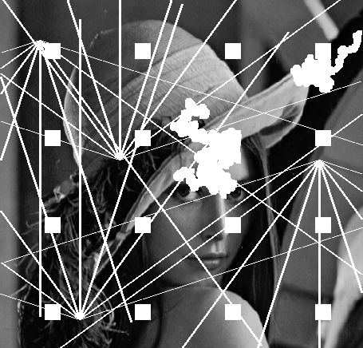
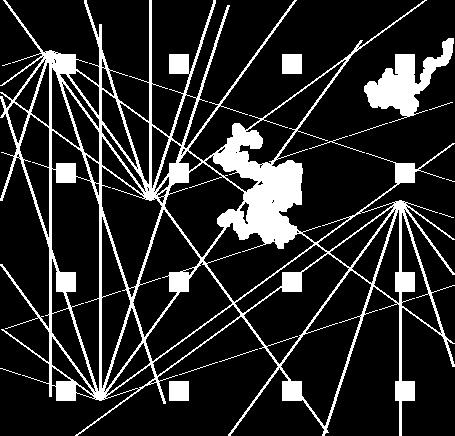

# TV-Inpainting via Preconditioned Douglas-Rachford Iteration

Variational image inpainting using Total Variation (TV) regularisation, solved with a Preconditioned Douglas-Rachford splitting algorithm. Implemented in Python with NumPy — no deep learning, no external ML libraries.

---

## Problem

Given a damaged image $f$ where pixels in a loss region $\Omega''$ are missing or corrupted, reconstruct the full image $u$ by solving:

$$\min_{u} \|\nabla u\|_{L^1(\Omega)} \quad \text{subject to} \quad u = f \text{ on } \Omega' = \Omega \setminus \Omega''$$

TV regularisation preserves sharp edges while smoothly interpolating across the damaged area.

## Algorithm

The TV minimisation is reformulated as a saddle-point problem and solved with the **Preconditioned Douglas-Rachford** algorithm from:

> *Preconditioned Douglas-Rachford Splitting Algorithms for Convex-Concave Saddle-Point Problems*  
> Kristian Bredies, Hongpeng Sun — [SFB Report 2014-002](https://imsc.uni-graz.at/mobis/publications/SFB-Report-2014-002_2.pdf)

Each iteration alternates between:
1. A proximal step for the primal variable $u$ — solved with **Symmetric Red-Black Gauss-Seidel**
2. A closed-form proximal step for the dual variable $p$ (projection onto the TV dual ball)

## Results

| Damaged image | Loss mask | Reconstruction |
|:---:|:---:|:---:|
|  |  | *(run notebook to generate)* |

- Image size: 436 × 455
- Known pixels: 166,178 — Unknown pixels: 32,202
- 200 DR iterations, 3 inner Gauss-Seidel sweeps per step
- Runtime: ~2.6 seconds

## Notebooks

| Notebook | Description |
|---|---|
| [`Image_Inpainting.ipynb`](Image_Inpainting.ipynb) | Clean single implementation — full history storage, convergence plots |
| [`Adebanji_Image_Inpainting.ipynb`](Adebanji_Image_Inpainting.ipynb) | Development notebook — compares two implementations: memory-efficient (scalar variables) and full history storage |

Both notebooks run locally without any external dependencies (no Google Colab required).

## Implementation

```
gradient          — forward finite differences (vectorised)
divergence        — backward finite differences, adjoint of gradient
neighbor_sum      — 4-connected neighbour sum via array slicing
proximalFstar     — projection onto dual TV ball of radius alpha/tau
proximalG         — data-fidelity: pin known pixels to f, free unknowns
sym_red_black_gauss_seidel — vectorised checkerboard solver for (λI − μΔ)u = b
tv_inpainting     — main DR loop
```

All operations are fully vectorised with NumPy — no Python loops over pixels.

## Requirements

```
numpy
Pillow
matplotlib
```

```bash
pip install numpy Pillow matplotlib
```

## Usage

Open either notebook in Jupyter or VS Code and run all cells. The images `u0.png` and `lossregion.png` are included in the repository.

To use your own image:
- Replace `u0.png` with your damaged image (greyscale or RGB)
- Replace `lossregion.png` with a binary mask: **black (0)** = known, **white (255)** = region to reconstruct

## Structure

```
Image_inpainting/
├── Image_Inpainting.ipynb           # Clean notebook (recommended entry point)
├── Adebanji_Image_Inpainting.ipynb  # Development notebook (two implementations)
├── u0.png                           # Damaged input image
└── lossregion.png                   # Binary loss mask
```
