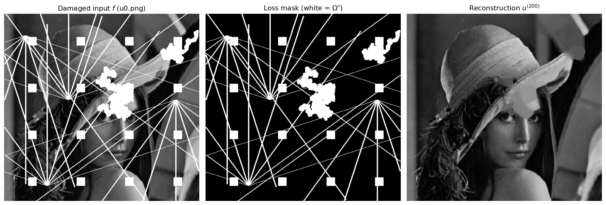
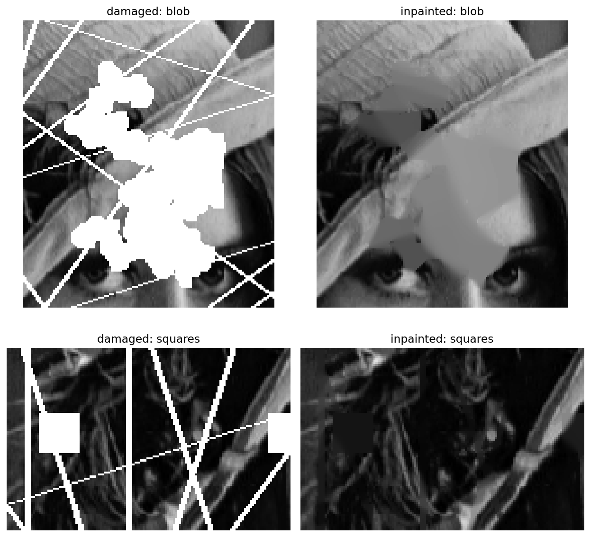
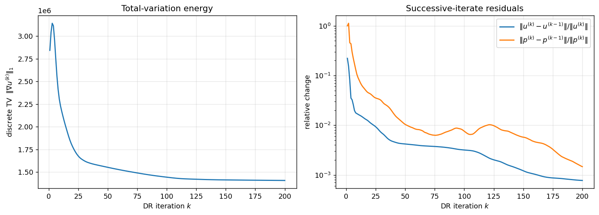

# Introduction and Motivation

## What image inpainting is

*Inpainting* is the reconstruction of missing, damaged, or deliberately removed
parts of an image from the information that survives around them. The word is
borrowed from art restoration, where conservators retouch cracks and losses in a
painting so that the repair is invisible to a non-specialist viewer. The *term*
"image inpainting" was introduced to the image-processing community by
Bertalmío, Sapiro, Caselles and Ballester at SIGGRAPH 2000 [19]; the same
interpolation problem had already been posed variationally by Masnou and Morel
in 1998 as level-line continuation [20], and Chan and Shen supplied the
systematic variational analysis shortly afterwards [21, 22].

Formally, one is given an image domain $\Omega \subset \mathbb{R}^2$ (in
practice a rectangular pixel grid), a *loss region* or *inpainting domain*
$\Omega'' \subset \Omega$, and observed data $f$ that is trustworthy only on the
complement
$$
\Omega' \;=\; \Omega \setminus \Omega''.
$$
The task is to produce an image $u$ defined on all of $\Omega$ that agrees with
$f$ on $\Omega'$ and that continues the visual structure of $f$ plausibly across
$\Omega''$. Nothing in the data itself constrains $u$ inside $\Omega''$; the
problem is therefore not merely ill-posed in Hadamard's sense but genuinely
*under-determined*. Every inpainting method is, at bottom, a statement about
what kind of image is considered a priori plausible, and the differences between
methods are differences between priors.

This document describes, derives, and documents one particular answer to that
question, as implemented in the repository `Image_inpainting`: the prior is that
natural images have small **total variation** (TV), and the numerical machinery
used to impose it is a **preconditioned Douglas-Rachford (PDR) splitting**
algorithm applied to the convex-concave saddle-point reformulation of the
variational problem. The algorithmic reference is Bredies and Sun's SFB report
[12], later published in *SIAM Journal on Numerical Analysis*
[13].

## Why inpainting matters

The practical reach of inpainting is wide, and each application stresses a
different part of the problem.

* **Restoration of photographs, film and manuscripts.** Scratches, dust, fold
  lines, and emulsion damage form thin, elongated loss regions. These are the
  regime in which geometric/variational methods excel: the missing set is thin,
  so the surrounding data determines the answer almost completely.
* **Object and text removal.** Removing a date stamp, a logo, a wire, or an
  unwanted passer-by produces a compact hole of moderate size. Here the prior
  starts to matter, since the reconstruction has to invent plausible content.
* **Error concealment in transmission and storage.** Lost packets or corrupted
  blocks in a compressed bitstream leave structured, block-shaped gaps that must
  be filled in real time; speed, not photorealism, dominates.
* **Scientific and medical imaging.** Detector gaps, dead pixels, bad columns in
  CCD arrays, metal artefacts in computed tomography, and masked regions in
  astronomical surveys are all inpainting problems in which a *predictable and
  explainable* reconstruction is worth more than a visually convincing one.
* **Preprocessing for downstream analysis.** Segmentation, registration and
  optical flow algorithms often degrade badly on images with holes; filling them
  in a way that does not introduce spurious edges is a useful preprocessing
  step.
* **Image editing and compositing.** Disocclusion after object motion,
  view synthesis, and seam removal in panorama stitching are inpainting in
  disguise.

## Why a classical variational method, in the era of learned models

The last decade of inpainting research has been dominated by learned models:
context encoders [27], contextual attention [28], partial
convolutions [29], Fourier-convolution architectures [30], and
diffusion-model samplers [31, 32]. These produce
photorealistic completions of large holes that no variational model can match,
because they have learned what the world looks like, whereas a variational model
knows only what a *smooth* function looks like.

There nevertheless remain strong reasons to understand and to use methods of the
kind implemented here.

1. **No training data, no training.** The method has one regularization
   parameter and no learned weights. It runs on a laptop, on any image, in any
   domain, with no dataset and no GPU.
2. **Predictability and analysis.** The reconstruction is the solution of a
   convex program. Its properties (edge preservation, contrast loss,
   staircasing) are theorems, not empirical observations
   [18, 24]. Nothing is hallucinated: the model
   cannot invent an object that was not implied by the surrounding geometry.
   In forensic, medical and scientific settings that guarantee is often
   decisive.
3. **Sharp behaviour on thin damage.** For scratches, text overlays and grid
   artefacts — precisely the regime of the example in this repository — TV
   inpainting is essentially exact, and it is cheap.
4. **It is still the substrate of modern hybrids.** Plug-and-play and unrolled
   architectures replace one proximal operator of a splitting scheme by a
   learned denoiser but retain the splitting scheme itself. Understanding the
   splitting is a prerequisite for understanding the hybrid.
5. **Pedagogical value.** The problem is the smallest realistic setting in which
   the whole apparatus of modern convex imaging — bounded variation, Fenchel
   duality, proximal operators, saddle points, operator splitting,
   preconditioning, and numerical linear algebra — appears at once and must fit
   together exactly.

## Scope and contributions of this document

This document is a self-contained technical reference for the repository. It

* states the variational problem and its discretization precisely
  (Sections 2 and 7);
* develops the required background in bounded variation and convex analysis, in
  the exact generality needed and no more (Section 3), including full
  derivations of the two proximal operators that the code implements;
* surveys the classical inpainting literature and the research arc that leads
  from the ROF denoising model to preconditioned splitting methods, and from
  there to the learned turn (Sections 4 and 5);
* derives the preconditioned Douglas-Rachford iteration from the primal-dual
  optimality system, states the convergence result it relies on, and explains
  precisely why preconditioning is what makes an inexact inner solve legitimate
  (Section 6);
* proves the discrete adjointness of the implemented gradient and divergence,
  derives the red-black Gauss-Seidel update from the linear system it solves,
  and explains the checkerboard vectorization (Section 7);
* walks through every function in the repository with quoted source and maps
  each line to the mathematics (Section 8);
* reports reproduced experiments — reconstruction, convergence, runtime,
  parameter sensitivity, and numerical verification of the operator identities
  (Section 9);
* records the limitations and the specific implementation observations found
  while preparing this document — including a discrepancy between the inner
  solver the algorithm's convergence theory requires and the one the code
  performs (Section 7.6.3) — and proposes concrete research and engineering
  directions (Sections 8.11, 10 and 11).

Two classes of statement are carefully separated throughout. Numbers reported as
**measured** were obtained by re-executing the repository's own code on the
repository's own data on the author's machine while preparing this document;
the reproduction script is described in Section 9.2. Numbers reported as
**stated in the repository** are quoted from the repository's `README.md` and
are flagged as such.

## Repository layout

```
Image_inpainting/
|-- Image_Inpainting.ipynb           # clean notebook (recommended entry point)
|-- Adebanji_Image_Inpainting.ipynb  # development notebook (two implementations)
|-- u0.png                           # damaged input image f
|-- lossregion.png                   # binary loss mask
|-- README.md
`-- docs/                            # this document and its figures
```

The two notebooks share all mathematical building blocks and differ only in the
main loop: `Image_Inpainting.ipynb` stores the full iteration history, while
`Adebanji_Image_Inpainting.ipynb` contains both that version and a
memory-efficient version that overwrites its state each iteration
(Section 8.8). Dependencies are `numpy`, `Pillow` and `matplotlib`; there is no
deep-learning framework and no external optimization library.

# Problem Definition and Formulation

## The continuous variational problem

Let $\Omega \subset \mathbb{R}^2$ be a bounded Lipschitz domain, let
$\Omega'' \subset \Omega$ be the open loss region, and let
$\Omega' = \Omega \setminus \Omega''$ carry the observed data $f$. The model
solved in this repository is
$$
\min_{u} \; \|\nabla u\|_{L^1(\Omega)}
\qquad \text{subject to} \qquad u = f \;\text{ on } \Omega' ,
\tag{2.1}
$$
which is exactly the statement in the repository's `README.md` and in the header
cell of both notebooks. For $u$ merely of bounded variation, the quantity
$\|\nabla u\|_{L^1(\Omega)}$ is interpreted as the total variation seminorm
$\mathrm{TV}(u) = |Du|(\Omega)$ defined in Section 3.1.

Three features of (2.1) deserve immediate comment.

**The constraint is hard.** The data are treated as exact on $\Omega'$: there is
no noise model and no trade-off parameter balancing fidelity against
regularity. This is the appropriate model when the damage is *localized and
known* — a scratch mask, a text overlay, a dead-pixel map — as opposed to the
denoising situation in which every pixel is corrupted a little.

**The objective is scale-invariant in its weight.** If (2.1) is replaced by
$\min_u \alpha \,\mathrm{TV}(u)$ subject to the same constraint, the minimizer
is unchanged for every $\alpha > 0$. The regularization weight is therefore not
a modelling parameter of the *problem*; in the algorithm of Section 6 it
nevertheless reappears as a parameter of the *iteration* and does influence the
speed of convergence. This is verified experimentally in Section 9.7.

**Nothing couples the interior of $\Omega''$ to the data except through the
boundary.** All information reaches the hole through $\partial\Omega''$, which
is why the geometry of the mask — its width, not merely its area — governs how
well the method performs (Sections 9.1 and 10).

## The penalized variant

A close relative of (2.1), used when the observation is noisy, replaces the hard
constraint by a quadratic discrepancy term restricted to the known set,
$$
\min_{u} \; \alpha\,\mathrm{TV}(u) \;+\; \frac{1}{2}\int_{\Omega'} (u-f)^2 \,dx .
\tag{2.2}
$$
Formulation (2.2) is the model treated by Getreuer's IPOL article on TV
inpainting with split Bregman, which writes it as
$\arg\min_{u\in\mathrm{BV}}\|u\|_{\mathrm{TV}(\Omega)}
+ \frac{\lambda}{2}\int_{\Omega\setminus D}(f-u)^2\,dx$
with $D = \Omega''$ the inpainting domain [16, eq. (9)] — identical to (2.2)
after dividing by $\lambda$ and setting $\alpha = 1/\lambda$. It is the
inpainting analogue of
the Rudin-Osher-Fatemi denoising functional [1]; as Getreuer notes, (2.2)
differs from ROF only in that the discrepancy integral runs over
$\Omega\setminus D$ rather than over all of $\Omega$. Problem (2.1) is
recovered from (2.2) in the limit where the fidelity weight tends to infinity;
equivalently, (2.1) is the case in which the fidelity term is the *indicator
function* of the constraint set. The implementation in this repository takes the
hard-constraint route, which has the pleasant consequence that its
data-fidelity proximal operator is an exact projection with a one-line
implementation (Section 3.3.4).

## Why total variation

The choice of $\mathrm{TV}$ as the regularizer is not arbitrary. Consider the
three simplest quadratic alternatives on the hole:

* **Harmonic inpainting**, $\min \int_{\Omega''} |\nabla u|^2$, solves the
  Laplace equation $\Delta u = 0$ in $\Omega''$ with Dirichlet data from
  $\Omega'$. It is linear, fast, and blurs every edge that crosses the hole,
  because finite-energy functions in $H^1$ cannot jump.
* **Biharmonic inpainting**, $\min \int_{\Omega''} |\Delta u|^2$, matches
  gradients as well as values at $\partial\Omega''$ and therefore continues
  shading more convincingly, at the price of over- and undershoot near strong
  edges and a still-blurred edge.
* **Total variation**, $\min \int |\nabla u|$, is the borderline case
  $p=1$ of $\int|\nabla u|^p$. It is the smallest exponent for which the
  functional is still convex, and — critically — the largest for which
  discontinuous functions have finite energy. A jump of height $h$ across a
  curve of length $L$ costs exactly $hL$ in $\mathrm{TV}$ but costs
  $+\infty$ in the $H^1$ energy. Consequently TV minimizers may, and do, contain
  edges.

The precise structural statement behind "TV preserves edges" is the **coarea
formula** (Section 3.1): the total variation of $u$ equals the integral over all
grey levels $t$ of the perimeter of the level set $\{u > t\}$. Minimizing TV is
therefore minimizing the total length of level lines. Across a hole, the
cheapest way to connect two boundary level lines is by the shortest curve, so TV
inpainting continues an edge as a straight line — it prefers *straight
continuation* over *blurring*. It is also, by the same token, blind to texture,
which consists of a great deal of level-line length that TV would rather
delete (Section 10).

## Well-posedness: what can and cannot be guaranteed

Existence of a minimizer of (2.1) follows from the direct method of the calculus
of variations. Let $(u_n)$ be a minimizing sequence. The constraint pins $u_n$
on the set $\Omega'$ of positive measure, so $\|u_n\|_{L^1}$ is controlled by
$\mathrm{TV}(u_n)$ through a Poincaré-type inequality; the sequence is therefore
bounded in $\mathrm{BV}(\Omega)$. By the compactness theorem for $\mathrm{BV}$
[2], a subsequence converges strongly in $L^1$ to some
$u^\star \in \mathrm{BV}(\Omega)$; total variation is lower semicontinuous under
$L^1$ convergence, so $\mathrm{TV}(u^\star) \le \liminf \mathrm{TV}(u_n)$, and
the constraint set is closed under $L^1$ convergence. Hence $u^\star$ is a
minimizer. In the discrete setting used by the code the argument is simpler
still: the objective is a continuous, coercive-on-the-quotient, convex function
on a finite-dimensional affine subspace, and a minimizer exists.

Uniqueness, by contrast, *fails in general*. The objective is convex but not
strictly convex: it is one-homogeneous, and it is flat along entire families of
perturbations. The standard example is a hole straddling a straight edge: any
monotone re-routing of the level line that does not lengthen it has the same TV.
The set of minimizers is convex and closed, and every algorithm discussed here
converges to *some* element of it; which element depends on the initialization.
This is not a numerical defect but a property of the model, and it is one
motivation for higher-order or anisotropic regularizers (Section 11).

## The discrete problem

The implementation works entirely in the discrete setting, which is defined once
and for all here and developed in Section 7. Let the image be an
$M \times N$ array, $M = 436$, $N = 455$ for the supplied data, and let
$$
X = \mathbb{R}^{M \times N}, \qquad
Y = X \times X = \mathbb{R}^{2 \times M \times N}
$$
be the primal (image) and dual (vector field) spaces, equipped with the
Euclidean inner products
$$
\langle u, v\rangle_X = \sum_{i,j} u_{i,j} v_{i,j},
\qquad
\langle p, q\rangle_Y = \sum_{d \in \{y,x\}} \sum_{i,j} p^d_{i,j} q^d_{i,j}.
$$
Let $\mathcal{I}' \subset \{0,\dots,M-1\}\times\{0,\dots,N-1\}$ be the index set
of known pixels (mask value $0$) and $\mathcal{I}''$ its complement (mask value
$255$). With the forward-difference gradient $K = \nabla$ of Section 7.2, the
discrete problem is
$$
\min_{u \in X} \; \alpha \|\nabla u\|_{2,1}
\qquad \text{subject to} \qquad
u_{i,j} = f_{i,j} \;\;\forall (i,j) \in \mathcal{I}',
\tag{2.3}
$$
where the *isotropic* discrete total variation is
$$
\|p\|_{2,1} \;=\; \sum_{i,j} \sqrt{(p^y_{i,j})^2 + (p^x_{i,j})^2},
\qquad p = \nabla u .
\tag{2.4}
$$
The pointwise Euclidean norm inside the sum is what makes the discretization
*isotropic* — rotationally more nearly invariant than the "anisotropic"
alternative $\sum_{i,j}(|p^y_{i,j}| + |p^x_{i,j}|)$, which favours axis-aligned
edges and produces visible diamond-shaped artefacts. The code implements the
isotropic version; the pointwise Euclidean norm appears explicitly in
`proximalFstar` as `np.sqrt(np.sum(p**2, axis=0))`.

# Mathematical and Terminological Foundations

This section fixes the vocabulary and derives, from first principles, every
formula the implementation uses. Readers fluent in convex analysis may skip to
Section 3.5, which assembles the pieces into the saddle-point problem that the
algorithm actually solves.

## Functions of bounded variation and the TV seminorm

### Definition

For $u \in L^1(\Omega)$, the **total variation** of $u$ is
$$
\mathrm{TV}(u) \;=\; \sup\left\{ \int_\Omega u \,\operatorname{div}\varphi \,dx
\;:\; \varphi \in C^1_c(\Omega;\mathbb{R}^2),\; \|\varphi\|_\infty \le 1
\right\},
\tag{3.1}
$$
and $u$ is a **function of bounded variation**, $u \in \mathrm{BV}(\Omega)$, if
$\mathrm{TV}(u) < \infty$. The space $\mathrm{BV}(\Omega)$ with the norm
$\|u\|_{\mathrm{BV}} = \|u\|_{L^1} + \mathrm{TV}(u)$ is a Banach space; the
standard reference is Ambrosio, Fusco and Pallara [2].

Definition (3.1) is *dual*: it tests $u$ against smooth compactly supported
vector fields. This is not a technical convenience but the structural fact that
the whole algorithm rests on. The supremum ranges over the unit ball of an
$L^\infty$ norm, and taking a supremum over a ball is precisely the
Legendre-Fenchel conjugate of an indicator function (Section 3.2.4). The dual
variable $p$ in the code *is* a discrete version of the test field $\varphi$,
and the constraint $\|\varphi\|_\infty \le 1$ *is* the ball onto which
`proximalFstar` projects.

If $u \in W^{1,1}(\Omega)$ is weakly differentiable, an integration by parts in
(3.1) gives $\mathrm{TV}(u) = \int_\Omega |\nabla u|\,dx$, which is the form
written in the repository's problem statement. For general $u \in \mathrm{BV}$
the distributional gradient $Du$ is a finite $\mathbb{R}^2$-valued Radon measure
and $\mathrm{TV}(u) = |Du|(\Omega)$, its total mass. The decomposition
$Du = \nabla u\,\mathcal{L}^2 + D^j u + D^c u$ into absolutely continuous, jump
and Cantor parts is what allows a BV function to have genuine edges: the jump
part is supported on a rectifiable curve set and contributes
$\int_{J_u} |u^+ - u^-| \,d\mathcal{H}^1$.

### The coarea formula

The identity that explains the geometric behaviour of TV is
$$
\mathrm{TV}(u) \;=\; \int_{-\infty}^{\infty}
\mathrm{Per}\big(\{x \in \Omega : u(x) > t\}\big)\, dt ,
\tag{3.2}
$$
where $\mathrm{Per}(E)$ is the perimeter of $E$ in $\Omega$ [2]. Total
variation is the integral of the lengths of all level lines. Two consequences
are used repeatedly in this document:

* A grey-level jump of height $h$ along a curve of length $L$ costs exactly
  $hL$. Doubling the sharpness of an edge does not increase the cost; only its
  length and contrast do. This is why TV keeps edges rather than smoothing them.
* Minimizing TV inside a hole means minimizing level-line length inside the
  hole, i.e. connecting boundary level lines by geodesics. In a plane, geodesics
  are straight, which is why TV inpainting continues edges *linearly* and cannot
  reproduce curvature — the observation that motivated curvature-driven
  diffusion and Euler-elastica models [21, 23].

### Contrast loss

TV regularization is not free of bias. Strong and Chan [18] proved for
the ROF model that a feature of scale $r$ suffers an intensity loss inversely
proportional to $r$: small features are attenuated more than large ones, and
edges remain in place but lose contrast. In the hard-constrained inpainting
problem (2.1) the known pixels are exactly preserved, so the bias acts only
inside the hole, where it shows up as flat regions taking a value biased toward
the average of their surroundings (visible in Section 9.3).

## Convex analysis

Throughout, $H$ denotes a real Hilbert space, and
$\overline{\mathbb{R}} = \mathbb{R}\cup\{+\infty\}$.

### Proper, convex, lower semicontinuous functions

A function $F : H \to \overline{\mathbb{R}}$ is **proper** if it is not
identically $+\infty$, **convex** if
$F(\lambda x + (1-\lambda) y) \le \lambda F(x) + (1-\lambda) F(y)$ for
$\lambda \in [0,1]$, and **lower semicontinuous** (lsc) if
$\{x : F(x) \le c\}$ is closed for every $c$. The class of proper, convex, lsc
functions on $H$ is written $\Gamma_0(H)$; it is closed under addition, under
composition with a bounded linear operator, and under the operations below.
Every function appearing in this document belongs to $\Gamma_0$.

### Indicator and support functions

For a nonempty closed convex set $C \subseteq H$, the **indicator function**
$$
\delta_C(x) \;=\;
\begin{cases}
0, & x \in C, \\
+\infty, & x \notin C,
\end{cases}
$$
is in $\Gamma_0(H)$. Indicator functions are the device by which *hard
constraints* become *terms in an objective*: minimizing $F(x)$ subject to
$x \in C$ is minimizing $F(x) + \delta_C(x)$ over all of $H$. Both constraints
in this project — "$u = f$ on $\Omega'$" and "$\|p\| \le \alpha$ pointwise" —
enter the algorithm this way. The **support function** of $C$ is
$\sigma_C(y) = \sup_{x \in C}\langle x, y\rangle$.

### Subdifferential

Since $F$ need not be differentiable, derivatives are replaced by the
**subdifferential**
$$
\partial F(x) \;=\; \{ v \in H : F(z) \ge F(x) + \langle v, z-x\rangle
\;\;\forall z \in H \},
\tag{3.3}
$$
the set of slopes of affine minorants touching at $x$. Fermat's rule becomes
$$
x^\star \text{ minimizes } F \iff 0 \in \partial F(x^\star).
\tag{3.4}
$$
If $F$ is differentiable at $x$ then $\partial F(x) = \{\nabla F(x)\}$. For
$F = |\cdot|$ on $\mathbb{R}$, $\partial F(0) = [-1,1]$. The map
$\partial F : H \to 2^H$ of a function in $\Gamma_0(H)$ is **maximally
monotone**, meaning $\langle v_1 - v_2, x_1 - x_2\rangle \ge 0$ whenever
$v_i \in \partial F(x_i)$, and its graph is not properly contained in the graph
of another monotone operator. Maximal monotonicity is exactly the hypothesis
under which the splitting theory of Section 6 operates.

### The convex conjugate (Legendre-Fenchel transform)

The **convex conjugate** of $F : H \to \overline{\mathbb{R}}$ is
$$
F^*(y) \;=\; \sup_{x \in H} \; \big( \langle x,y\rangle - F(x) \big).
\tag{3.5}
$$
Geometrically, $F^*(y)$ is the maximal vertical gap between the linear function
$\langle \cdot, y\rangle$ and $F$; $F^*$ is always convex and lsc as a
pointwise supremum of affine functions. For $F \in \Gamma_0(H)$ the
**biconjugate theorem** gives $F^{**} = F$, so no information is lost, and the
conjugate pair provides two equivalent descriptions of the same object: by its
values, or by its supporting hyperplanes.

The facts used later are:

1. $\partial F^* = (\partial F)^{-1}$, i.e.
   $y \in \partial F(x) \iff x \in \partial F^*(y)$.
2. **Fenchel-Young:** $F(x) + F^*(y) \ge \langle x,y\rangle$, with equality iff
   $y \in \partial F(x)$.
3. $\delta_C^* = \sigma_C$ and $\sigma_C^* = \delta_C$ for closed convex $C$.
4. **Conjugate of a norm.** If $F(x) = \alpha\|x\|$ for a norm $\|\cdot\|$ with
   dual norm $\|\cdot\|_*$, then
   $$
   F^*(y) \;=\; \delta_{\{\|y\|_* \le \alpha\}}(y),
   \tag{3.6}
   $$
   the indicator of the dual-norm ball of radius $\alpha$. *Proof.* If
   $\|y\|_* \le \alpha$ then $\langle x,y\rangle \le \alpha\|x\|$ for all $x$,
   so the supremum in (3.5) is $\le 0$ and is attained at $x=0$, giving
   $F^*(y)=0$. If $\|y\|_* > \alpha$ there is $x_0$ with
   $\langle x_0,y\rangle > \alpha\|x_0\|$; scaling $x_0$ by $t \to \infty$ makes
   $t(\langle x_0,y\rangle - \alpha\|x_0\|) \to +\infty$, so
   $F^*(y) = +\infty$. $\square$

Identity (3.6), applied to the discrete TV norm (2.4), is the origin of the
whole dual formulation. The dual norm of $\|\cdot\|_{2,1}$ is
$$
\|p\|_{2,\infty} \;=\; \max_{i,j} \sqrt{(p^y_{i,j})^2 + (p^x_{i,j})^2},
$$
so the conjugate of $\alpha\|\cdot\|_{2,1}$ is the indicator of the set of
vector fields whose *pointwise Euclidean length* never exceeds $\alpha$. This
set is the "TV dual ball" of the repository's documentation.

## Proximal operators

### Definition and basic properties

For $F \in \Gamma_0(H)$ and a step size $\tau > 0$, the **proximal operator**
(Moreau [4]) is
$$
\operatorname{prox}_{\tau F}(x)
\;=\; \arg\min_{z \in H} \;\Big( F(z) + \tfrac{1}{2\tau}\|z - x\|^2 \Big).
\tag{3.7}
$$
The objective in (3.7) is strongly convex, so the minimizer exists and is
unique, and $\operatorname{prox}_{\tau F} : H \to H$ is single-valued and
everywhere defined. Writing Fermat's rule (3.4) for (3.7),
$$
0 \in \partial F(z) + \tfrac{1}{\tau}(z - x)
\iff x \in (I + \tau \partial F)(z)
\iff z = (I + \tau\partial F)^{-1}(x),
$$
which identifies the proximal operator with the **resolvent** of the maximally
monotone operator $\partial F$:
$$
\operatorname{prox}_{\tau F} \;=\; (I + \tau \partial F)^{-1}.
\tag{3.8}
$$
This is the bridge between the optimization view (Section 3.3) and the
monotone-operator view (Section 6): every resolvent appearing in the
Douglas-Rachford iteration is a proximal operator, and every proximal operator
is a resolvent. Proximal operators are firmly nonexpansive, hence
$1$-Lipschitz, which is the source of the stability of proximal algorithms.

The **Moreau decomposition** relates the proximal operator of a function to that
of its conjugate:
$$
x \;=\; \operatorname{prox}_{\tau F}(x) \;+\; \tau\operatorname{prox}_{F^*/\tau}(x/\tau),
\tag{3.9}
$$
so that whichever of $F$, $F^*$ has the cheaper proximal operator may be used.

### Example: indicator function

If $F = \delta_C$ then (3.7) reads
$\arg\min_{z \in C} \|z-x\|^2$, i.e.
$$
\operatorname{prox}_{\tau \delta_C} \;=\; \Pi_C, \quad
\text{the orthogonal projection onto } C,
\tag{3.10}
$$
*independently of $\tau$*. Both proximal steps in this implementation are of
this type, which is why both are exact and closed-form.

### Example: the dual TV ball, and `proximalFstar`

Let $F(p) = \delta_B(p)$ with
$B = \{p \in Y : \sqrt{(p^y_{i,j})^2+(p^x_{i,j})^2} \le \rho \;\forall i,j\}$.
The set $B$ is a Cartesian product over pixels of Euclidean balls of radius
$\rho$ in $\mathbb{R}^2$, so the projection decouples pixelwise, and the
projection onto a Euclidean ball is the familiar radial clipping
$$
\big(\Pi_B p\big)_{i,j}
= \frac{p_{i,j}}{\max\!\big(1,\; |p_{i,j}|_2 / \rho \big)}
= \begin{cases}
p_{i,j}, & |p_{i,j}|_2 \le \rho,\\[2pt]
\rho\, p_{i,j}/|p_{i,j}|_2, & |p_{i,j}|_2 > \rho .
\end{cases}
\tag{3.11}
$$
*Derivation.* For a single pixel, minimize $\|z - p\|^2$ over
$\|z\| \le \rho$. If $\|p\| \le \rho$ the unconstrained minimizer $z=p$ is
feasible. Otherwise the constraint is active, $\|z\| = \rho$, and maximizing
$\langle z,p\rangle$ over the sphere of radius $\rho$ gives
$z = \rho p/\|p\|$ by Cauchy-Schwarz. $\square$

The repository's `proximalFstar` implements exactly (3.11) with
$\rho = \alpha/\tau$; the reason the radius carries a $1/\tau$ is analysed in
Section 6.8.

### Example: the data-fidelity projection, and `proximalG`

Let $C = \{u \in X : u_{i,j} = f_{i,j} \;\forall (i,j)\in\mathcal{I}'\}$, an
affine subspace of $X$ obtained by fixing a subset of coordinates. Projection
onto such a set is coordinatewise:
$$
\big(\Pi_C u\big)_{i,j} =
\begin{cases}
f_{i,j}, & (i,j) \in \mathcal{I}' \quad(\text{known}),\\
u_{i,j}, & (i,j) \in \mathcal{I}'' \quad(\text{unknown}),
\end{cases}
\tag{3.12}
$$
because the coordinates decouple: those in $\mathcal{I}'$ have a single
admissible value, and those in $\mathcal{I}''$ are unconstrained, so the nearest
admissible point keeps them. This is the repository's `proximalG`, verbatim: it
copies $u$, then overwrites the known pixels with $f$.

### Example: soft thresholding

For completeness — the repository also defines an unused `proximalF` — the
proximal operator of $\alpha\|\cdot\|_1$ on $\mathbb{R}^n$ is the componentwise
**soft-thresholding**
$$
\operatorname{prox}_{\tau\alpha\|\cdot\|_1}(x)_i
= \operatorname{sign}(x_i)\max(|x_i| - \alpha\tau, 0),
\tag{3.13}
$$
obtained by minimizing $\alpha|z| + \frac{1}{2\tau}(z-x)^2$ separately in each
coordinate and using $\partial|\cdot|(0) = [-1,1]$. Formulas (3.11) and (3.13)
illustrate the two sides of the Moreau decomposition (3.9): shrinkage in the
primal corresponds to clipping in the dual. The correspondence is exact
*componentwise* — soft thresholding of $|\cdot|$ is dual to projection onto an
interval — and the isotropic formula (3.11) is its two-dimensional analogue, in
which the interval is replaced by the Euclidean ball, matching the pointwise
Euclidean norm of the isotropic TV (2.4). Soft thresholding is dual to the
*anisotropic* discretization, which is why the repository defines `proximalF`
but does not use it.

## Saddle points and Fenchel-Rockafellar duality

Let $X, Y$ be real Hilbert spaces, $K : X \to Y$ bounded and linear, and
$F \in \Gamma_0(X)$, $G \in \Gamma_0(Y)$. The **primal** problem
$$
\min_{x \in X} \; F(x) + G(Kx)
\tag{3.14}
$$
has the **dual** problem
$$
\max_{y \in Y} \; -F^*(-K^*y) - G^*(y),
\tag{3.15}
$$
and both are encoded in the **saddle-point problem**
$$
\min_{x \in X}\;\max_{y \in Y}\;\; \langle Kx, y\rangle + F(x) - G^*(y).
\tag{3.16}
$$
Formulation (3.16) is obtained from (3.14) by replacing $G(Kx)$ with its
biconjugate, $G(Kx) = \sup_y \{\langle Kx,y\rangle - G^*(y)\}$, and exchanging
$\min$ and $\sup$ — legitimate under standard qualification conditions
[3, 7]. A pair $(x^\star,y^\star)$ is a saddle point
if
$$
\langle Kx^\star, y\rangle + F(x^\star) - G^*(y)
\;\le\;
\langle Kx^\star, y^\star\rangle + F(x^\star) - G^*(y^\star)
\;\le\;
\langle Kx, y^\star\rangle + F(x) - G^*(y^\star)
$$
for all $x,y$, and then $x^\star$ solves (3.14) and $y^\star$ solves (3.15).
Differentiating the saddle-point condition gives the **primal-dual optimality
system**
$$
\begin{cases}
0 \in \partial F(x^\star) + K^*y^\star, \\
0 \in \partial G^*(y^\star) - K x^\star,
\end{cases}
\tag{3.17}
$$
which is the monotone inclusion that Section 6 splits and solves.

**A note on notation.** Bredies and Sun [12] write the saddle-point
problem as $\min_x \max_y \langle Kx,y\rangle + F(x) - G(y)$, with $G$ already
in conjugate position. The notebooks write
$\min_u \max_p \langle Ku,p\rangle + G(u) - F^*(p)$, i.e. they use $G$ for the
data term and $F^*$ for the dual-ball indicator. The correspondence is
$$
\underbrace{F_{\text{paper}}}_{\text{data term}} = \underbrace{G_{\text{code}}}_{\texttt{proximalG}},
\qquad
\underbrace{G_{\text{paper}}}_{\text{ball indicator}} = \underbrace{F^*_{\text{code}}}_{\texttt{proximalFstar}} .
$$
This document uses the code's names when discussing the code and the paper's
names when quoting the theory, and flags the correspondence wherever confusion
is possible.

## The primal-dual form of the TV inpainting problem

Assemble the pieces. Take
$$
X = \mathbb{R}^{M\times N},\quad
Y = \mathbb{R}^{2\times M\times N},\quad
K = \nabla \;(\text{Section 7.2}),
$$
$$
G_{\text{code}}(u) = \delta_{C}(u), \quad
C = \{u : u = f \text{ on } \mathcal{I}'\},
\qquad
F_{\text{code}}(p) = \alpha \|p\|_{2,1}.
$$
The primal problem $\min_u G_{\text{code}}(u) + F_{\text{code}}(\nabla u)$ is
exactly (2.3). By (3.6), $F^*_{\text{code}} = \delta_{B_\alpha}$ with
$B_\alpha = \{p : |p_{i,j}|_2 \le \alpha \;\forall i,j\}$, so the saddle-point
form is
$$
\boxed{\;
\min_{u \in X} \max_{p \in Y} \;\;
\langle \nabla u, p\rangle \;+\; \delta_C(u) \;-\; \delta_{B_\alpha}(p) .
\;}
\tag{3.18}
$$
Reading (3.18) back: the inner maximization returns $\alpha\|\nabla u\|_{2,1}$
whenever $p$ is free to point along $\nabla u$ with maximal length, recovering
the primal TV; the outer minimization enforces the data constraint. Both
functions in (3.18) are indicators, so — as promised — both proximal steps are
projections, given by (3.11) and (3.12).

The corresponding optimality system (3.17) reads
$$
0 \in \partial \delta_C(u^\star) - \operatorname{div} p^\star,
\qquad
0 \in \partial \delta_{B_\alpha}(p^\star) - \nabla u^\star ,
\tag{3.19}
$$
using $K^* = -\operatorname{div}$, proved discretely in Section 7.3. The second
inclusion says $\nabla u^\star \in \partial\delta_{B_\alpha}(p^\star)$, i.e.
$\nabla u^\star$ lies in the normal cone to the ball at $p^\star$: wherever
$\nabla u^\star \ne 0$ this forces $p^\star$ onto the sphere, aligned with the
gradient,
$p^\star_{i,j} = \alpha\,\nabla u^\star_{i,j}/|\nabla u^\star_{i,j}|_2$, and
where $\nabla u^\star = 0$ it constrains $p^\star$ only to lie in the ball. This
is the discrete analogue of the classical statement that the dual variable is a
vector field of magnitude $\alpha$ pointing along the gradient, hence normal to
the level lines.

# Classical and Foundational Approaches to Inpainting

Before turning to the algorithm, it is worth situating the TV model among its
predecessors and competitors. Classical inpainting divides broadly into
*geometric* methods, which extend structure by solving a partial differential
equation or minimizing an energy, and *exemplar* methods, which copy pixels from
elsewhere in the image. The model of this repository is squarely in the first
camp.

## Harmonic and biharmonic (diffusion) inpainting

The simplest possible model minimizes the Dirichlet energy over the hole,
$$
\min_u \int_{\Omega''} |\nabla u|^2 \,dx
\quad \text{subject to } u = f \text{ on } \Omega',
$$
whose Euler-Lagrange equation is Laplace's equation $\Delta u = 0$ in $\Omega''$
with Dirichlet boundary data $u|_{\partial\Omega''} = f$. Equivalently, one runs
the heat equation $u_t = \Delta u$ inside the hole until steady state. The
solution is the harmonic extension of the boundary data.

The method is linear, has a unique solution, and is solvable by any Poisson
solver — including, notably, exactly the red-black Gauss-Seidel machinery used
in Section 7.6. Its defect is fundamental rather than numerical: harmonic
functions are real-analytic in the interior, so *no edge can survive the
crossing of a hole*. Any structure that enters $\Omega''$ leaves it blurred over
the full width of the hole. The maximum principle also guarantees no new extrema
appear, so texture is annihilated.

Raising the order to the **biharmonic** model, $\min \int_{\Omega''}
|\Delta u|^2$ with $\Delta^2 u = 0$, matches both value and normal derivative at
$\partial\Omega''$, giving visually smoother continuation of shading, at the
cost of overshoot near strong boundary gradients (a Gibbs-like ringing) and
still without edge preservation.

TV inpainting can be read as the same idea with the exponent lowered from $2$ to
$1$, which is precisely the threshold at which discontinuous minimizers become
admissible.

## Transport-based PDE inpainting

Bertalmío, Sapiro, Caselles and Ballester [19] introduced the term "image
inpainting" to the field and proposed propagating information along the
*isophotes* (level lines) of the image, in imitation of what a restorer does by
eye. Their evolution transports a smoothness measure — the image Laplacian —
along the isophote direction, i.e. perpendicular to the gradient,
$$
u_t \;=\; \nabla (\Delta u) \cdot \vec{N}, \qquad
\vec{N} \parallel \nabla^\perp u ,
$$
with the direction field $\vec N$ normalized in the actual scheme, and
interleaved with anisotropic diffusion steps to keep the result stable. The
scheme continues both the geometry (level-line directions) and the smoothness
(the Laplacian as a measure of "how much shading") into the hole. It is
third-order and nonlinear, and it is not the gradient flow of any energy, which
makes analysis hard; but it was the first method to give convincing results on
scratch removal and it set the agenda for the variational models that followed.

## Curvature- and elastica-based models

Because TV connects level lines by *straight* segments, it cannot restore a
curve that should continue with curvature across a wide hole, and it violates
the psychophysical *connectivity principle* when the hole is wide relative to
the gap between the objects to be reconnected. Chan and Shen therefore proposed
**curvature-driven diffusion** (CDD) [21], which modulates the TV flow by a
function of the level-line curvature $\kappa$, allowing diffusion to be stronger
where the level lines are strongly bent. The variational counterpart is the
**Euler elastica** model of Chan, Kang and Shen [23], which penalizes
$$
\int_{\Omega} \big(a + b\,\kappa^2\big)\,|\nabla u| \,dx ,
$$
reducing to TV for $b=0$. Elastica reconnects contours across large gaps and
restores curvature, at the price of a non-convex, fourth-order problem with
substantially harder numerics.

Related higher-order models include the Mumford-Shah-Euler image model and
Cahn-Hilliard inpainting for binary images [33], which exploits the phase-field
structure of the Cahn-Hilliard equation to reconnect level sets across gaps.
Chan and Shen's survey [24] and their textbook [34] give a unified account of
this family.

## Exemplar-based and texture methods

Geometric methods reconstruct *structure*, not *texture*: they cannot invent the
statistics of grass, fabric, or hair. Exemplar methods take the opposite view
and copy. Efros and Leung [26] synthesized texture by, for each unknown pixel,
finding patches elsewhere in the image whose known neighbourhood best matches
and sampling from them. Criminisi, Pérez and Toyama [25] turned this into a
practical inpainting algorithm by adding a *filling-order* term: patches on
strong isophotes entering the hole are filled first, so linear structure
propagates before texture is grown around it, combining some of the strengths of
both families. Hybrid decompositions that split an image into a cartoon
component (inpainted variationally) and a texture component (inpainted by
exemplar synthesis) were the natural next step.

The trade-off is summarized below.

| Family | Prior | Strength | Weakness |
|---|---|---|---|
| Harmonic / biharmonic | $u$ smooth | linear, fast, unique | blurs all edges |
| Transport PDE [19] | isophotes continue | good on thin damage | no energy, hard to analyse |
| TV [22] | level lines short | edges preserved, convex | straight continuation, no texture, staircasing |
| CDD / elastica [21, 23] | curvature penalized | reconnects curved contours | non-convex, higher order, slow |
| Exemplar [25, 26] | self-similarity | textures reproduced | structure can break; combinatorial |
| Learned [27, 30] | learned image statistics | large holes, semantics | needs training data; can hallucinate |

# Research Evolution: From ROF Denoising to Preconditioned Splitting

The algorithm implemented here sits at the confluence of two research streams
that developed largely independently and merged in the late 2000s: the
*modelling* stream, which established total variation as a regularizer for
imaging, and the *algorithmic* stream, which developed operator splitting for
monotone inclusions. This section traces both.

## The modelling stream

**1992 — ROF.** Rudin, Osher and Fatemi [1] proposed removing noise by
minimizing total variation subject to constraints fixing the mean and the noise
variance,
$$
\min_u \mathrm{TV}(u) \quad \text{s.t.}\quad
\int_\Omega u \,dx = \int_\Omega f \,dx,
\qquad
\int_\Omega (u-f)^2 dx = \sigma^2 |\Omega| ,
$$
or in the now-standard penalized form
$\min_u \frac{1}{2}\|u-f\|_2^2 + \alpha\,\mathrm{TV}(u)$. This was the first
demonstration that a non-smooth, one-homogeneous regularizer could preserve
edges where quadratic regularization could not, and it opened the whole field of
non-smooth variational imaging. The obstacle it left behind was numerical: the
functional is not differentiable, and the original paper solved a
time-marching PDE with an $\varepsilon$-smoothed $|\nabla u|$, which is slow and
introduces a modelling bias.

**1998-2005 — TV for inpainting.** Masnou and Morel [20] formulated disocclusion
as level-line continuation. Chan and Shen [22] analysed the harmonic and TV
inpainting models and showed why TV, unlike harmonic inpainting, keeps edges;
they also identified its failure to satisfy the connectivity principle for wide
holes, which motivated CDD [21] and elastica [23]. Their 2005 survey [24]
consolidated the variational picture. In parallel, Strong and Chan [18] gave the
exact analysis of edge location and contrast loss under TV regularization, which
remains the standard explanation of TV's systematic bias.

**2010 — beyond TV.** Bredies, Kunisch and Pock introduced **total generalized
variation** (TGV) [17], which penalizes a balance of first and higher-order
derivatives and eliminates the staircasing artefact of TV while retaining edge
preservation and convexity. TGV is the natural upgrade path for the model
implemented here (Section 11.1), and — importantly for this project — the same
authors' preconditioned Douglas-Rachford framework was subsequently applied to
TGV-regularized problems as well [14].

## The algorithmic stream

**1956 — Douglas-Rachford.** Douglas and Rachford [9] introduced an alternating
implicit scheme for the heat equation in two and three space variables, a
splitting of the Laplacian into its coordinate parts. The scheme was purely a
device for PDE time stepping; nothing in the original paper concerns convexity.

**1979 — Lions-Mercier.** Lions and Mercier [10] recognized that the
Douglas-Rachford recursion makes sense for the sum of two maximally monotone
operators, $0 \in Az + Bz$, and proved convergence in that generality. This is
the form in which the method is used today.

**1992 — Eckstein-Bertsekas.** Eckstein and Bertsekas [11] showed that
Douglas-Rachford splitting is an instance of the *proximal point algorithm*
applied to a particular operator, and that the alternating direction method of
multipliers (ADMM) is Douglas-Rachford applied to the dual. Their paper also
established that the resolvents may be evaluated *inexactly* provided the errors
are absolutely summable, $\sum_k (\alpha_k + \beta_k) < \infty$. That
error-control condition is precisely the practical difficulty that
preconditioned Douglas-Rachford removes.

**2004-2011 — first-order methods for TV.** Chambolle [5] gave a dual algorithm
for the ROF problem, exploiting the fact (Section 3.2.4) that the TV conjugate
is the indicator of a ball, so the dual problem is a smooth quadratic over a
simple convex set. Goldstein and Osher [15] introduced the **split Bregman**
method, equivalent to ADMM, in which an auxiliary variable $d \approx \nabla u$
is introduced and the resulting subproblems are a Poisson-type linear solve and
a shrinkage. Getreuer's IPOL article [16] is the standard tutorial
implementation of TV inpainting by split Bregman and is the closest published
sibling of the present repository — same problem, different splitting.
Combettes and Pesquet's survey [8] systematized the whole proximal-splitting
toolbox for signal processing.

**2011 — Chambolle-Pock.** The first-order primal-dual algorithm [6] solves the
saddle-point problem (3.16) by alternating a dual ascent step, a primal descent
step, and an extrapolation:
$$
p^{k+1} = \operatorname{prox}_{\sigma G^*}\!\big(p^k + \sigma K \bar{u}^k\big),
\quad
u^{k+1} = \operatorname{prox}_{\tau F}\!\big(u^k - \tau K^* p^{k+1}\big),
\quad
\bar u^{k+1} = 2u^{k+1} - u^k .
$$
It is explicit in $K$ — no linear system is solved — but it is only
*conditionally* stable: convergence requires the step-size restriction
$$
\sigma\tau\,\|K\|^2 \;<\; 1 ,
\tag{5.1}
$$
and since $\|\nabla\|^2 \le 8$ on a 2-D grid (Section 7.4), the steps must be
small. The method is the reference against which Bredies and Sun benchmark their
algorithm.

**2014-2015 — preconditioned Douglas-Rachford.** Bredies and Sun [12, 13]
observed that the implicit Douglas-Rachford treatment of the *linear* part of
the primal-dual system is unconditionally stable and free of step-size
restrictions, but requires solving a linear system $Tx = b$ at each iteration.
Rather than solving it accurately, or controlling the error in the sense of
Eckstein-Bertsekas, they replace $T^{-1}$ by a *feasible preconditioner*
$M^{-1}$ and prove weak convergence of the resulting iteration for *any* fixed
number of inner iterations, with no error control whatsoever. For TV problems on
a grid, the symmetric red-black Gauss-Seidel sweep is a feasible preconditioner
and is embarrassingly parallel. This is the algorithm implemented in this
repository, and Section 6 derives it.

## The learned turn, and where this project sits

From 2016 onward the field's centre of gravity moved to learned models:
context encoders [27] introduced adversarial training for hole filling;
contextual attention [28] let the network copy from distant regions, recovering
the exemplar idea inside a network; partial convolutions [29] handled irregular
masks properly; LaMa [30] used fast Fourier convolutions to obtain an
image-wide receptive field and strong resolution generalization; and diffusion
models — either as inpainting samplers with a pretrained unconditional prior
[31] or as latent text-conditioned generators [32] — now define the state of the
art for large holes and semantic completion.

Against that backdrop, this project is deliberately classical. It occupies the
regime in which the learned models are unnecessary and the classical model is
provably adequate: **thin-to-moderate damage on a single image, no training
data, full explainability, seconds of CPU time.** Its scientific interest lies
less in the reconstruction quality than in the algorithmic content — an
unconditionally stable, preconditioned splitting method whose inner solver is a
three-sweep Gauss-Seidel with no error control and a convergence proof.

# The Preconditioned Douglas-Rachford Algorithm

This section derives the iteration implemented by `tv_inpainting`, following
Bredies and Sun [12, 13] and specializing to the inpainting problem at each
step.

## Setting: a monotone inclusion

Recall the saddle-point problem (3.16) in the paper's notation,
$$
\min_{x \in X}\max_{y \in Y}\; \langle Kx, y\rangle + F(x) - G(y),
\tag{6.1}
$$
with $F \in \Gamma_0(X)$ the data term (`proximalG` in the code) and
$G \in \Gamma_0(Y)$ the dual-ball indicator (`proximalFstar` in the code). The
optimality system (3.17) is
$$
\begin{cases}
0 \in K^* y + \partial F(x),\\
0 \in -Kx + \partial G(y).
\end{cases}
\tag{6.2}
$$
Set $z = (x,y) \in H = X\times Y$ and define
$$
A \;=\; \begin{pmatrix} \partial F & 0\\ 0 & \partial G\end{pmatrix},
\qquad
B \;=\; \begin{pmatrix} 0 & K^*\\ -K & 0\end{pmatrix}.
\tag{6.3}
$$
Then (6.2) is the monotone inclusion
$$
0 \;\in\; Az + Bz .
\tag{6.4}
$$
$A$ is maximally monotone as the product of subdifferentials of $\Gamma_0$
functions; $B$ is linear, bounded and **skew-symmetric**
($B^* = -B$), hence monotone with $\langle Bz,z\rangle = 0$, and maximally so.
This *monotone-plus-skew* splitting is the structural observation on which
everything rests: the non-smooth, problem-specific difficulty sits in $A$, where
it is handled by proximal operators, and the coupling between primal and dual
sits in $B$, which is linear.

## Vanilla Douglas-Rachford, and why it is not enough

Douglas-Rachford splitting for (6.4) with step size $\sigma > 0$ reads, with an
auxiliary variable $v$,
$$
\begin{cases}
z^{k+1} = J_{\sigma B}(v^k),\\
v^{k+1} = v^k + J_{\sigma A}(2z^{k+1}-v^k) - z^{k+1},
\end{cases}
\tag{6.5}
$$
where $J_{\sigma A} = (I+\sigma A)^{-1}$ and $J_{\sigma B} = (I+\sigma B)^{-1}$
are resolvents [10, 12]. Two features are decisive.

*First*, (6.5) is **unconditionally stable**: unlike forward-backward or
primal-dual schemes, it never evaluates $B$ explicitly, so there is no
counterpart of the restriction (5.1). Any $\sigma > 0$ converges.

*Second*, that stability is bought with an implicit step. Because
$B$ is the skew coupling (6.3), the resolvent $J_{\sigma B}$ requires solving
$$
(I + \sigma B)\begin{pmatrix}x\\y\end{pmatrix}
= \begin{pmatrix}x + \sigma K^* y\\ y - \sigma K x\end{pmatrix}
= \begin{pmatrix}a\\b\end{pmatrix},
$$
and eliminating $y = b + \sigma Kx$ gives the **normal-equation-like system**
$$
\underbrace{(I + \sigma^2 K^*K)}_{=:T}\,x \;=\; a - \sigma K^* b .
\tag{6.6}
$$
With $K = \nabla$, $T = I - \sigma^2\Delta$: a screened-Poisson (Helmholtz-type)
operator. Solving (6.6) exactly at every iteration — by FFT, multigrid, or a
direct factorization — is possible but expensive, and it is wasteful, since the
outer iteration only needs a rough solve.

The classical remedy, due to Eckstein and Bertsekas [11] and used by split
Bregman [15] and inexact ADMM, is to solve (6.6) approximately with a few
Gauss-Seidel sweeps and appeal to the summable-error theory. Bredies and Sun
point out the gap in that practice: the condition
$\sum_k(\alpha_k+\beta_k) < \infty$ is essentially never verified in
implementations, and without it convergence is not guaranteed. Their preconditioned
variant closes the gap.

## Douglas-Rachford as a preconditioned proximal point method

The key reformulation [12, §2.1] is to introduce $w \in \sigma A z$ and write
(6.4) as the system
$$
\begin{pmatrix}0\\0\end{pmatrix}
\in
\begin{pmatrix}\sigma B z + w\\ -z + (\sigma A)^{-1}w\end{pmatrix},
\tag{6.7}
$$
in the product space $U = H \times H$ with unknown $u = (z,w)$. Denoting by
$\mathcal{A}$ the operator on the right-hand side, the problem is
$0 \in \mathcal{A}u$, to which the *proximal point* method with a linear,
self-adjoint, positive semi-definite **preconditioner**
$\mathcal{M} : U \to U$ applies:
$$
0 \;\in\; \mathcal{M}\big(u^{k+1} - u^k\big) + \mathcal{A}u^{k+1}.
\tag{6.8}
$$
With the specific choice
$$
\mathcal{M} = \begin{pmatrix} I & -I\\ -I & I\end{pmatrix},
\qquad
\mathcal{A} = \begin{pmatrix}\sigma B & I\\ -I & (\sigma A)^{-1}\end{pmatrix},
$$
iteration (6.8) reproduces classical Douglas-Rachford exactly [12, eq. (2.2)].
The value of this reformulation is that $\mathcal{M}$ is now an explicit object
that may be *modified*: replacing the exact $\mathcal{M}$ by a cheaper
approximation turns the exact-resolvent iteration into an implementable one,
while keeping it inside the proximal-point convergence theory, where
$\mathcal{M}$-monotonicity of the residuals does the work that summable errors
did before.

Carrying this out — introducing $N_1, N_2$ with $N_1 - I \ge 0$, $N_2 - I \ge 0$
in place of the identity blocks, choosing $N_2 = I$, and writing
$N_1 = M - \sigma^2 K^*K$ — Bredies and Sun obtain [12, eqs. (2.14)-(2.17)] the
update
$$
x^{k+1} = x^k + M^{-1}\big(b^k - Tx^k\big),
\qquad
T = I + \sigma^2 K^*K,
\qquad
b^k = \bar{x}^k - \sigma K^*\bar y^k .
\tag{6.9}
$$
Equation (6.9) is the heart of the method: instead of solving $Tx^{k+1} = b^k$,
one applies **one step of a linear stationary iterative method with
preconditioner $M$** to the previous iterate.

## The PDR iteration

Collecting the primal, dual and auxiliary updates gives the algorithm as stated
in [12, Table 2.1]:

> **PDR.** Given $(x^0,\bar x^0, y^0, \bar y^0)$, a step size $\sigma > 0$,
> $T = I + \sigma^2K^*K$ and $M = N_1 + \sigma^2K^*K$, iterate
> $$
> \begin{aligned}
> b^k &= \bar x^k - \sigma K^* \bar y^k, \\
> x^{k+1} &= x^k + M^{-1}\big(b^k - Tx^k\big), \\
> y^{k+1} &= \bar y^k + \sigma K x^{k+1}, \\
> \bar x^{k+1} &= \bar x^k + (I+\sigma\partial F)^{-1}\big[2x^{k+1}-\bar x^k\big] - x^{k+1},\\
> \bar y^{k+1} &= \bar y^k + (I+\sigma\partial G)^{-1}\big[2y^{k+1}-\bar y^k\big] - y^{k+1}.
> \end{aligned}
> $$

Structurally: line 1 forms the right-hand side of the linear system from the
auxiliary variables; line 2 applies the preconditioner; line 3 is an *exact*
dual update, obtained from the elimination $y = \bar y + \sigma K x$ in the
resolvent of $\sigma B$; and lines 4-5 are the Douglas-Rachford reflections,
$\bar\cdot \leftarrow \bar\cdot + \operatorname{prox}(2\cdot - \bar\cdot) - \cdot$,
one for each of the two proximal operators. Note that lines 4-5 contain the
*only* two places where the problem-specific functions enter, and both are the
projections derived in Sections 3.3.3 and 3.3.4.

The correspondence with the repository's `tv_inpainting` is exact and is
tabulated in Section 8.9. In the notation of the code, $x \leftrightarrow u$,
$y \leftrightarrow p$, $\bar x \leftrightarrow \texttt{u\_bar}$,
$\bar y \leftrightarrow \texttt{p\_bar}$, $K = \nabla$,
$K^* = -\operatorname{div}$, and the step size that plays the role of $\sigma$ in
the algorithm above is the *product* `sigma * tau` in the code (Section 6.8).

## Feasible preconditioners

The convergence theory hinges on which $M$ are admissible.

> **Definition** [12, Def. 2.9]. Let $M, T$ be linear, continuous, self-adjoint
> and positive semi-definite. $M$ is a **feasible preconditioner** for $T$ if $M$
> is positive definite and $M - T$ is positive semi-definite.

The condition $M \succeq T$ is a "no-overshoot" requirement: the preconditioned
step $M^{-1}(b - Tx)$ must not overshoot the exact solve. Several classical
iterative methods are feasible in this sense [12, Examples 2.10-2.13]:

* $M = T$ recovers the exact Douglas-Rachford iteration.
* $M = \lambda I$ with $\lambda \ge 1 + \sigma^2\|K\|^2$ is the Richardson
  method; note how the feasibility condition reappears here as a step-size
  restriction, exactly as in the explicit methods.
* A damped Jacobi method $M = (\lambda+1)D$ with $\lambda \ge
  \lambda_{\max}(T-D)$ is feasible.
* **Symmetric Gauss-Seidel / SSOR.** Splitting $T = D - E - E^*$ into diagonal
  and strict-triangular parts and taking $M_0 = \frac{1}{\omega}D - E$, the
  composition
  $$
  M \;=\; M_0\big(M_0 + M_0^* - T\big)^{-1}M_0^*
  \tag{6.10}
  $$
  is a feasible preconditioner whenever $M_0 - \frac12 T$ is positive definite
  [12, Prop. 2.12], and it is realized in practice by the two-half-step update
  $$
  x^{k+1/2} = x^k + M_0^{-1}(b^k - Tx^k),
  \qquad
  x^{k+1} = x^{k+1/2} + M_0^{-*}(b^k - Tx^{k+1/2}).
  \tag{6.11}
  $$
  For $\omega = 1$ this is precisely a **forward sweep followed by a backward
  sweep of Gauss-Seidel** — the symmetric Gauss-Seidel method $M_{\mathrm{SGS}}$.
  Feasibility follows because $T = I + \sigma^2K^*K$ has all diagonal entries
  $\ge 1$, so
  $\langle (M_0 - \frac12 T)x,x\rangle = (\frac1\omega - \frac12)\langle Dx,x\rangle
  \ge (\frac1\omega-\frac12)\|x\|^2 > 0$ for $\omega \in\, ]0,2[$.

Crucially:

> **Proposition** [12, Prop. 2.14]. If $M$ is a feasible preconditioner for $T$,
> then applying it $n \ge 1$ times, i.e.
> $x^{k+(i+1)/n} = x^{k+i/n} + M^{-1}(b^k - Tx^{k+i/n})$ for $i=0,\dots,n-1$,
> corresponds to $x^{k+1} = x^k + M_n^{-1}(b^k - Tx^k)$ with $M_n$ again a
> feasible preconditioner.

This proposition is what licenses a fixed, small number of inner sweeps such as
the repository's `n_for_gauss = 3`. **Any** number of inner *symmetric*
Gauss-Seidel sweeps — one, three, ten — yields a feasible preconditioner and
hence a convergent outer iteration. No error control, no accuracy tolerance, no
summability condition. The number of sweeps is a pure efficiency knob, and
Section 9.7 measures its effect. The emphasis on *symmetric* is not decorative:
Section 7.6.3 shows that the sweep the repository actually performs is the
non-symmetric one, and quantifies the gap.

## Convergence

> **Theorem** [12, Thm. 2.3]. If a solution of the saddle-point problem (6.1)
> exists and the preconditioner condition is satisfied
> ($N_1 - I \succeq 0$, $N_2 - I \succeq 0$; equivalently $M \succeq T$ with
> $M$ positive definite), then the iteration converges weakly to a fixed point
> $u^\star = (x^\star,y^\star,\bar x^\star,\bar y^\star)$, and $(x^\star,y^\star)$
> is a solution of the saddle-point problem.

The proof proceeds by showing that the fixed-point map $\mathcal{T}$ of the
iteration is non-expansive in the seminorm $\|\cdot\|_{\mathcal{M}}$ induced by
the preconditioner, that
$\sum_k \|u^k - u^{k+1}\|^2_{\mathcal{M}} \le \|u^0-u^\star\|^2_{\mathcal{M}}$
(Fejér monotonicity), that $I - \mathcal{T}$ is demiclosed — note that
$\mathcal{T}$ here is the iteration map on $U$, not the linear operator $T$ of
(6.9) — and finally that the weak accumulation point is unique. In finite
dimensions, as here, weak convergence is convergence.

Bredies and Sun also record [12, Remark 2.4] that the *projected* quantities
$$
x^{k+1}_{\mathrm{test}} = (I+\sigma\partial F)^{-1}[2x^{k+1}-\bar x^k],
\qquad
y^{k+1}_{\mathrm{test}} = (I+\sigma\partial G)^{-1}[2y^{k+1}-\bar y^k]
\tag{6.12}
$$
converge to the same limit and always lie in $\operatorname{dom}\partial F$ and
$\operatorname{dom}\partial G$. These are exactly the variables the code calls
`u_test` and `p_test`. They are the *feasible* iterates — `u_test` satisfies the
data constraint exactly and `p_test` lies in the dual ball exactly, whereas
$x^{k}$ and $y^{k}$ need only do so in the limit. This has a practical
consequence for the repository, discussed in Sections 8.11 and 9.8: the
implementation returns $u$, not $u_{\mathrm{test}}$.

The follow-up journal papers extend the framework: [13] is the archival version
of the theory, and [14] applies preconditioned Douglas-Rachford to TV- and
TGV-regularized imaging problems, proving an $O(1/k)$ rate for restricted
primal-dual gaps.

## Why preconditioning helps: a summary

Four distinct benefits are worth separating, because they are often conflated.

1. **It makes the implicit step affordable.** Exactly solving
   $(I - \sigma^2\Delta)x = b$ at every iteration is the only expensive part of
   Douglas-Rachford. Replacing $T^{-1}$ by $n$ sweeps of red-black Gauss-Seidel
   reduces the cost per outer iteration to a handful of $O(MN)$ stencil passes.

2. **It removes the error-control obligation.** In the inexact-ADMM tradition
   one must *prove* the inner solve accurate enough. In the PDR framework the
   inexact solve is not an approximation of the algorithm — it *is* the
   algorithm, with a different (still feasible) preconditioner. The convergence
   theorem covers it verbatim.

3. **It retains unconditional stability.** The comparison to draw is with
   Chambolle-Pock [6], which is explicit in $K$ and therefore obeys
   $\sigma\tau\|K\|^2 < 1$. PDR has no such restriction; its step size may be
   chosen for speed rather than stability. Bredies and Sun's numerical
   experiments on ROF denoising report that their preconditioned iterations are
   competitive with existing fast algorithms including Chambolle-Pock and
   FISTA, with the quadratic variant PDRQ fastest — "very fast for appropriate
   step size $\sigma$ and inner iteration number $n$" in the
   high-regularization regime that matters for heavily corrupted images
   [12, §5]. The variant implemented in this repository is the general PDR
   iteration, not PDRQ.

4. **It exploits the structure of the operator.** For $K = \nabla$ on a regular
   grid, $T$ is a five-point stencil, and red-black ordering makes a Gauss-Seidel
   sweep *fully parallel within each colour* (Section 7.6). The preconditioner is
   therefore not merely cheap but vectorizable, which is what makes a pure-NumPy
   implementation of 200 iterations run in a couple of seconds (Section 9.5).

## The role of $\sigma$ and $\tau$ in this implementation

The abstract algorithm has a single step size $\sigma$. The repository exposes
*two* parameters, `sigma = 14` and `tau = 1/sigma`, and uses them in three
places:

* the linear-system coefficient `mu = (sigma*tau)**2`;
* the coupling factor `sigma*tau` multiplying `divergence(p_bar)` and
  `gradient(u)`;
* the radius `alpha/tau` of the dual ball in `proximalFstar`.

Comparing with the PDR box, the algorithm's step size is the *product*
$\sigma_{\mathrm{PDR}} = \sigma\tau$, and the linear operator is
$T = I + \sigma_{\mathrm{PDR}}^2 K^*K = \lambda I - \mu\Delta$ with
$\lambda = 1$ and $\mu = (\sigma\tau)^2$, exactly as the notebook's markdown
states. With the default choice $\tau = 1/\sigma$ one has
$$
\sigma_{\mathrm{PDR}} = \sigma\tau = 1,
\qquad
\lambda = \mu = 1,
\qquad
T = I - \Delta .
$$
The individually chosen value $\sigma = 14$ therefore does **not** act as a step
size at all: it survives only in the dual ball radius
$$
\rho = \frac{\alpha}{\tau} = \alpha\sigma = 14 ,
$$
i.e. it sets the **effective regularization weight** $\alpha_{\text{eff}} =
\alpha\sigma$. That reading is confirmed by the primary reference, whose dual
resolvent for the TV problem is
$(I+\sigma\partial G)^{-1}(v) = P_\alpha(v) = v/\max(1,|v|/\alpha)$
[12, eq. (4.3)] — the projection radius *is* the model's regularization
parameter $\alpha$, and it carries no $\sigma$. Whatever the code puts in that
slot is therefore the regularization weight, and here that is $\alpha/\tau$. As
observed in Section 2.1, for the hard-constrained problem
(2.3) the minimizer does not depend on $\alpha_{\text{eff}}$ — but the
*iteration* does, because the dual variable is clipped at that radius. In this
implementation $\sigma$ is thus best understood as a convergence-speed knob, and
Section 9.7 measures exactly that: larger $\sigma$ drives the TV energy down
faster, with diminishing returns beyond $\sigma \approx 14$.

# Discretization

This section makes precise the finite-dimensional objects the code manipulates,
proves the adjointness identity on which the dual formulation depends, and
derives the red-black Gauss-Seidel update from the linear system it is meant to
solve.

## Grid, spaces and inner products

The image is an $M \times N$ array of samples indexed by
$(i,j)$, $0 \le i < M$ (row, vertical, $y$) and $0 \le j < N$ (column,
horizontal, $x$). The unit grid spacing $h = 1$ is used throughout, so no
$1/h$ factors appear. As in Section 2.5,
$X = \mathbb{R}^{M\times N}$ and $Y = \mathbb{R}^{2\times M\times N}$ with the
Euclidean inner products; in NumPy, $u$ is an array of shape `(M, N)` and $p$ an
array of shape `(2, M, N)` whose slice `p[0]` is the vertical ($y$) component
and `p[1]` the horizontal ($x$) component.

## The discrete gradient

The gradient uses **forward differences with homogeneous Neumann-type boundary
handling**, i.e. the difference is set to zero at the last row/column, which is
equivalent to extending the image constantly beyond the boundary:
$$
(\nabla u)^y_{i,j} =
\begin{cases}
u_{i+1,j} - u_{i,j}, & 0 \le i < M-1,\\
0, & i = M-1,
\end{cases}
\qquad
(\nabla u)^x_{i,j} =
\begin{cases}
u_{i,j+1} - u_{i,j}, & 0 \le j < N-1,\\
0, & j = N-1.
\end{cases}
\tag{7.1}
$$
This is the standard discretization used by Chambolle [5] and by Chambolle and
Pock [6], and it is what the repository implements (Section 8.2). Setting the
last difference to zero rather than wrapping or reflecting matters: it makes the
operator's adjoint have exactly the boundary form of (7.3), and it means the
image boundary contributes nothing to the total variation.

## The discrete divergence and the adjointness identity

Define, for $p \in Y$,
$$
(\operatorname{div} p)_{i,j} = (\operatorname{div}_y p^y)_{i,j} + (\operatorname{div}_x p^x)_{i,j},
\tag{7.2}
$$
$$
(\operatorname{div}_y p^y)_{i,j} =
\begin{cases}
p^y_{0,j}, & i = 0,\\
p^y_{i,j} - p^y_{i-1,j}, & 0 < i < M-1,\\
-p^y_{M-2,j}, & i = M-1,
\end{cases}
\tag{7.3}
$$
and analogously in $x$. These are **backward differences**, with the first and
last rows carrying the one-sided forms. The following identity is what licenses
writing the dual problem with $K^* = -\operatorname{div}$.

> **Proposition (discrete integration by parts).** For all $u \in X$ and
> $p \in Y$,
> $$
> \langle \nabla u, p\rangle_Y \;=\; -\,\langle u, \operatorname{div} p\rangle_X .
> \tag{7.4}
> $$

*Proof.* The two coordinate directions decouple, so it suffices to prove the
one-dimensional statement for a single column $j$; write $u_i$, $p_i$ for
$u_{i,j}$, $p^y_{i,j}$. By (7.1),
$$
\sum_{i=0}^{M-1} (\nabla u)^y_i\, p_i
= \sum_{i=0}^{M-2} (u_{i+1}-u_i)\,p_i
= \sum_{i=1}^{M-1} u_i p_{i-1} \;-\; \sum_{i=0}^{M-2} u_i p_i .
$$
Collect the coefficient of $u_i$ in the right-hand side. For $i = 0$ only the
second sum contributes, giving $-p_0$. For $0 < i < M-1$ both contribute, giving
$p_{i-1} - p_i$. For $i = M-1$ only the first contributes, giving $p_{M-2}$.
Hence
$$
\sum_i (\nabla u)^y_i p_i
= -\sum_i u_i \cdot
\begin{cases}
p_0, & i=0,\\
p_i - p_{i-1}, & 0<i<M-1,\\
-p_{M-2}, & i=M-1,
\end{cases}
$$
and the bracket is exactly $(\operatorname{div}_y p)_i$ of (7.3). Summing over
$j$ and adding the analogous $x$-computation gives (7.4). $\square$

Identity (7.4) is not a formality: if the boundary rows of the divergence were
implemented with the naive interior formula, the adjointness would fail on a set
of measure $O(1/M)$ of the pixels, the operator $K^*K$ would not be symmetric,
the Gauss-Seidel preconditioner would not be feasible, and the convergence
theorem of Section 6.6 would not apply. Section 9.6 verifies (7.4) numerically
for the repository's implementation to a relative error of $3.0\times 10^{-15}$,
i.e. to machine precision.

## The discrete Laplacian and the norm of $K$

Combining (7.1) and (7.3), the composition $K^*K = -\operatorname{div}\nabla$ is
the standard five-point Laplacian with Neumann boundary conditions:
$$
\big(-\Delta u\big)_{i,j}
\;=\; k_{i,j}\,u_{i,j} \;-\!\!\sum_{(i',j') \in \mathcal{N}(i,j)}\!\! u_{i',j'} ,
\tag{7.5}
$$
where $\mathcal{N}(i,j)$ is the set of 4-connected neighbours *inside the grid*
and $k_{i,j} = |\mathcal{N}(i,j)| \in \{2,3,4\}$ is their number: $4$ in the
interior, $3$ on an edge, $2$ at a corner. Both quantities are precomputed by
the repository as `n_nbr` and `neighbor_sum` respectively; identity (7.5) is
verified numerically in Section 9.6 to $3.6\times10^{-15}$.

The operator norm obeys the classical bound
$$
\|K\|^2 = \|\nabla\|^2 \;\le\; 8 ,
\tag{7.6}
$$
which follows from $\|\nabla\|^2 = \|{-\Delta}\|$ and Gershgorin applied to
(7.5): each row of $-\Delta$ has diagonal $k_{i,j}\le 4$ and off-diagonal
absolute sum $k_{i,j} \le 4$, so the spectrum lies in $[0,8]$. A power iteration
on the repository's operators (Section 9.6) gives
$\|K\| \approx 2.8248$, against $\sqrt{8} \approx 2.8284$ — the slight deficit
being the boundary effect. Bound (7.6) is what makes explicit primal-dual
schemes take small steps, per (5.1); PDR does not need it, but it is quoted
here because it quantifies precisely what unconditional stability buys.

## The linear subproblem

By Section 6.4 the primal update requires the operator
$$
T \;=\; I + \sigma_{\mathrm{PDR}}^2 K^*K
\;=\; \lambda I - \mu\Delta ,
\qquad \lambda = 1,\quad \mu = \sigma_{\mathrm{PDR}}^2 = (\sigma\tau)^2 ,
\tag{7.7}
$$
which is exactly the system quoted in the notebooks. Written out with (7.5), the
system $Tu = b$ has rows
$$
\big(\lambda + k_{i,j}\mu\big)\,u_{i,j}
\;-\; \mu \!\!\sum_{(i',j')\in\mathcal{N}(i,j)}\!\! u_{i',j'}
\;=\; b_{i,j}.
\tag{7.8}
$$
$T$ is symmetric positive definite (diagonally dominant with positive diagonal),
so Gauss-Seidel converges for it, and — more importantly for the theory —
its diagonal entries are $\ge \lambda = 1$, which is exactly the hypothesis
needed for the symmetric Gauss-Seidel preconditioner to be *feasible*
(Section 6.5).

## Red-black Gauss-Seidel: derivation and vectorization

### The update formula

Solving (7.8) for $u_{i,j}$ gives the Gauss-Seidel update
$$
\boxed{\;
u_{i,j} \;\longleftarrow\;
\frac{b_{i,j} \;+\; \mu \sum_{(i',j')\in\mathcal{N}(i,j)} u_{i',j'}}
     {\lambda + k_{i,j}\,\mu}\;}
\tag{7.9}
$$
where, in the Gauss-Seidel (as opposed to Jacobi) method, the neighbour values
on the right are the *most recently updated* ones.

### Why checkerboard ordering

The stencil (7.5) couples $(i,j)$ only to its four 4-connected neighbours, and
every such neighbour has *opposite parity* of $i+j$. Colour the grid like a
chessboard,
$$
\mathcal{R} = \{(i,j) : i+j \text{ even}\},
\qquad
\mathcal{B} = \{(i,j) : i+j \text{ odd}\},
$$
so that $\mathcal{N}(i,j)\subset\mathcal{B}$ for $(i,j)\in\mathcal{R}$ and vice
versa. Then:

* Updating *all* red pixels simultaneously using the current black values is
  **exactly** Gauss-Seidel with the red-first ordering — not a Jacobi
  approximation of it — because no red update reads another red value.
* The red half-sweep is therefore an embarrassingly parallel, purely elementwise
  operation on arrays, and can be written with NumPy slicing, with no Python
  loop over pixels.
* Updating all black pixels next, with the *freshly written* red values,
  completes one full Gauss-Seidel sweep.

This colouring is the classical red-black ordering for five-point stencils, and
it is exactly why Bredies and Sun single out symmetric red-black Gauss-Seidel as
the preconditioner of choice for $K = \nabla$ [12, §4.2]. Note that the
*ordering* is what makes the sweep vectorizable; the *symmetrization* discussed
next is what makes the resulting preconditioner feasible. The two are
independent, and the repository implements the first but not the second.

### Symmetry, and what the code actually does

The preconditioner must be *self-adjoint* to be feasible (Section 6.5), and this
is where an implementation detail becomes a theoretical one.

Order the unknowns red-first. Because red pixels couple only to black ones, the
matrix has the block form
$$
T \;=\; \begin{pmatrix} D_{\mathcal{R}} & A \\ A^* & D_{\mathcal{B}}\end{pmatrix},
\qquad D_{\mathcal{R}}, D_{\mathcal{B}} \text{ diagonal, positive},
\tag{7.10}
$$
which is exactly the representation Bredies and Sun use [12, §4.2]. A red
half-sweep followed by a black half-sweep is one *forward* Gauss-Seidel sweep
in this ordering, with the block-triangular preconditioner
$$
M_0 \;=\; \begin{pmatrix} D_{\mathcal{R}} & 0 \\ A^* & D_{\mathcal{B}}\end{pmatrix},
$$
and $M_0$ is **not** self-adjoint: $M_0 - T$ has the off-diagonal block $-A$ and
is neither symmetric nor positive semi-definite. Bredies and Sun state the point
explicitly: "In order to obtain a feasible preconditioner for $T$, we have to
symmetrize it (see Proposition 2.12 and Example 2.13), leading to the symmetric
Red-Black Gauss-Seidel preconditioner, denoted by $M$" [12, §4.2]. The
symmetrized operator is $M = M_0 D^{-1} M_0^*$ of (6.10), realized by a forward
sweep followed by a backward sweep, i.e. by the half-sweep sequence
red-black-black-red. Since a colour updated twice in a row without its
neighbours changing is idempotent, that sequence collapses to
$$
\text{red} \to \text{black} \to \text{red},
$$
so **one symmetric red-black Gauss-Seidel sweep costs three half-sweeps, not
two.**

The repository's `sym_red_black_gauss_seidel` performs
$(\text{red}\to\text{black})^{n}$ — forward sweeps only. Despite its name it
therefore implements plain, not symmetric, red-black Gauss-Seidel, and its
implied preconditioner is $M_0$-based rather than the feasible $M$.

This was checked directly. On a $6\times5$ grid with $\lambda=\mu=1$, the affine
map $x \mapsto x + M^{-1}(b - Tx)$ realized by each half-sweep sequence was
extracted column by column and its $M$ examined:

| Half-sweep sequence | relative asymmetry of $M^{-1}$ | $\min\lambda\big(\mathrm{sym}(M-T)\big)$ | feasible? |
|---|---:|---:|:---:|
| $(R,B)$ — repository, 1 sweep | $2.5\times10^{-1}$ | $-1.767$ | no |
| $(R,B)^2$ — repository, 2 sweeps | $7.1\times10^{-2}$ | $-0.649$ | no |
| $(R,B)^3$ — repository, 3 sweeps | $2.7\times10^{-2}$ | $-0.314$ | no |
| $(R,B)^{10}$ — repository, 10 sweeps | $3.4\times10^{-4}$ | $-6.4\times10^{-3}$ | no |
| $(R,B,R)$ — symmetric GS | $0$ | $-9.4\times10^{-16}$ | **yes** |
| $(R,B,B,R)$ — forward then backward | $0$ | $-9.6\times10^{-16}$ | **yes** |
| $(R,B,R)^2$, $(R,B,R)^3$ | $\le 7\times10^{-17}$ | $\ge -9.8\times10^{-16}$ | **yes** |

The symmetric sequences give a self-adjoint $M$ with $M - T$ positive
semi-definite to machine precision — feasible, exactly as Proposition 2.12 and
Example 2.13 predict — and repeating them preserves feasibility while pushing
$M$ toward $T$, which is Proposition 2.14 made visible. The repository's
forward-only sequence fails both requirements, although the failure shrinks
rapidly with the number of sweeps (the asymmetry falls by roughly an order of
magnitude from one sweep to three, and by three orders by ten sweeps), because
repeated sweeps drive $M_n$ toward $T$ regardless of ordering.

**Consequence.** The convergence theorem of Section 6.6 does not apply verbatim
to the shipped inner solver; the guarantee is inherited only in the limit of
many sweeps, and what is observed in practice (Section 9.4) is the convergence
of a plain red-black Gauss-Seidel-preconditioned iteration, which is a
convergent smoother for $T$ but not a *feasible preconditioner* in the sense of
Definition 2.9. The remedy is one line: append a red half-sweep after the black
one, so that each iteration of the inner loop performs red-black-red. The extra
cost is one half-sweep out of two — about 50 % more work per sweep, or none at
all if `n_for_gauss` is reduced from $3$ to $2$, since $(R,B,R)^2$ contains five
half-sweeps against the current six. Section 9.7 shows the reconstruction is
insensitive to that trade.

### Cost

One sweep costs two `neighbor_sum` evaluations (four shifted additions each),
one division by a precomputed denominator, and two masked writes: about
$10\,MN$ floating-point operations plus memory traffic, all vectorized. The
denominator $\lambda + k_{i,j}\mu$ is loop-invariant and is computed once per
call in the repository's implementation.

## The dual constraint set in the discrete setting

Finally, the discrete dual ball of Section 3.3.3 is
$$
B_\rho = \Big\{ p \in Y : \sqrt{(p^y_{i,j})^2 + (p^x_{i,j})^2} \le \rho
\;\; \forall (i,j) \Big\},
$$
with $\rho = \alpha/\tau$ in the code. The projection (3.11) is a pointwise
radial clip, computed in NumPy by reducing over `axis=0` — the component axis of
the shape-`(2, M, N)` array — and broadcasting the resulting `(M, N)` array of
scale factors back over both components.

# Code Implementation

All quotations in this section are verbatim from the repository. Cell indices
are 0-based positions in the notebook JSON, as reported by
`json.load(open(...))["cells"]`. Unless stated otherwise, quotations are from
`Image_Inpainting.ipynb`, the clean notebook; the development notebook
`Adebanji_Image_Inpainting.ipynb` contains identical definitions.

## Data loading and preprocessing

`Image_Inpainting.ipynb`, cells 2 and 5, load the damaged image and the mask
with Pillow and convert them to NumPy arrays:

```python
notebook_dir = os.path.dirname(os.path.abspath('Image_Inpainting.ipynb')) if os.path.exists('Image_Inpainting.ipynb') else os.getcwd()
image = Image.open(os.path.join(notebook_dir, 'u0.png'))
imagedata = np.array(image)
```

```python
lossimg = Image.open(os.path.join(notebook_dir, 'lossregion.png'))
lossdata = np.array(lossimg)
```

Both files are RGB PNGs of size $455\times436$ (width $\times$ height), so
`imagedata` and `lossdata` have shape `(436, 455, 3)`. Cell 7 reduces them to
2-D `float64` arrays by taking the red channel, which is legitimate here because
the input is greyscale stored as RGB (verified: all three channels are
identical, Section 9.1):

```python
xdim = imagedata.shape[0]
ydim = imagedata.shape[1]
newimagedata = np.zeros((xdim, ydim), dtype= np.float64)
newlossdata  = np.zeros((xdim, ydim), dtype= np.float64)
for i  in range(0, xdim):
    for j in range(0, ydim):
        newimagedata[i][j] = imagedata[i][j][0]
        newlossdata[i][j] = lossdata[i][j][0]
```

This is the one place in the repository where a Python double loop over pixels
survives; it runs once, and it is equivalent to the vectorized
`imagedata[:, :, 0].astype(np.float64)`. Cell 8 then builds explicit coordinate
lists for the two subdomains,

```python
omega_prime = [(i,j) for i  in range(0, xdim) for j in range(0, ydim) if newlossdata[i][j] == 0]
omega_prime_prime = [(i,j) for i  in range(0, xdim) for j in range(0, ydim) if newlossdata[i][j] != 0]
```

which are used for reporting only; the algorithm itself indexes with the boolean
mask `newlossdata != 255` (Section 8.6). The boolean-mask version, together with
the pixel counts, appears in the development notebook at cell 8:

```python
# Domain partition as boolean masks
omega_prime       = newlossdata == 0    # Omega' : known pixels
omega_prime_prime = newlossdata == 255  # Omega'': unknown pixels to reconstruct

print(f"Known pixels    (Omega'  ): {omega_prime.sum():,}")
print(f"Unknown pixels  (Omega''): {omega_prime_prime.sum():,}")
```

with the stored output

```
Known pixels    (Omega'  ): 166,178
Unknown pixels  (Omega''): 32,202
```

## `gradient` — forward differences

`Image_Inpainting.ipynb`, cell 10:

```python
def gradient(img):
    """Forward finite differences along each axis; zero outside domain boundary."""
    gy = np.zeros_like(img)
    gx = np.zeros_like(img)
    gy[:-1, :] = np.diff(img, axis=0)
    gx[:, :-1] = np.diff(img, axis=1)
    return np.stack([gy, gx])
```

This is (7.1) line for line. `np.diff(img, axis=0)` produces the
$(M-1)\times N$ array of forward row differences, which is written into rows
$0,\dots,M-2$ of a zero array; row $M-1$ therefore stays zero, implementing the
boundary convention of (7.1). The same holds columnwise. `np.stack` returns
shape `(2, M, N)` with the $y$-component first, fixing the convention used
everywhere else. The routine allocates two temporaries and performs $2MN$
subtractions; there is no Python-level loop.

## `divergence` — backward differences, the negative adjoint

`Image_Inpainting.ipynb`, cell 11:

```python
def divergence(grad):
    """Backward finite differences — negative adjoint of the gradient."""
    gy, gx = grad[0], grad[1]
    dy = np.zeros_like(gy)
    dx = np.zeros_like(gx)
    dy[0, :]    =  gy[0, :]
    dy[1:-1, :] =  gy[1:-1, :] - gy[:-2, :]
    dy[-1, :]   = -gy[-2, :]
    dx[:, 0]    =  gx[:, 0]
    dx[:, 1:-1] =  gx[:, 1:-1] - gx[:, :-2]
    dx[:, -1]   = -gx[:, -2]
    return dy + dx
```

Each of the six assignments corresponds to one case of (7.3): the first row/
column takes the one-sided value $p_0$, the interior takes $p_i - p_{i-1}$, and
the last row/column takes $-p_{M-2}$. The three-case structure is not
cosmetic — it is precisely what makes the adjointness proposition of
Section 7.3 true, and hence what makes the whole primal-dual formulation
consistent. Numerical verification: Section 9.6.

## Checkerboard masks and neighbour counts

`Image_Inpainting.ipynb`, cell 12, precomputes the two colour masks and the
neighbour-count array:

```python
# Checkerboard masks — red: (i+j) even, black: (i+j) odd
mask_red = np.zeros((xdim, ydim), dtype=bool)
mask_red[0::2, 0::2] = True
mask_red[1::2, 1::2] = True
mask_black = ~mask_red

# Number of 4-connected neighbours per pixel (4 interior, 3 edge, 2 corner)
n_nbr = np.full((xdim, ydim), 4.0)
n_nbr[0, :]  -= 1;  n_nbr[-1, :] -= 1
n_nbr[:, 0]  -= 1;  n_nbr[:, -1] -= 1
```

The two strided assignments `[0::2, 0::2]` and `[1::2, 1::2]` mark exactly the
pixels with $i,j$ both even or both odd, i.e. $i+j$ even — the red set
$\mathcal{R}$ of Section 7.6.2. The four decrements construct
$k_{i,j}$ of (7.5): starting from $4$ everywhere and subtracting one for each
boundary the pixel touches, so corner pixels (touching two boundaries) end at
$2$. Both arrays are module-level constants captured by closure, which is why
`sym_red_black_gauss_seidel` needs no extra arguments.

## `neighbor_sum` — the off-diagonal part of the stencil

`Image_Inpainting.ipynb`, cell 13:

```python
def neighbor_sum(u):
    """Sum of 4-connected neighbours; zero contribution outside the domain."""
    ns = np.zeros_like(u)
    ns[:-1, :] += u[1:,  :]   # pixel below
    ns[1:,  :] += u[:-1, :]   # pixel above
    ns[:, :-1] += u[:,  1:]   # pixel right
    ns[:, 1:]  += u[:, :-1]   # pixel left
    return ns
```

Four shifted additions accumulate
$\sum_{(i',j')\in\mathcal{N}(i,j)}u_{i',j'}$. The asymmetric slice pairs
implement the "no neighbour outside the grid" rule automatically: for the
"pixel below" term, the destination is rows $0..M-2$ and the source is rows
$1..M-1$, so the last row receives nothing. Together with `n_nbr` this gives the
discrete Laplacian of (7.5) as `n_nbr * u - neighbor_sum(u)`; that identity is
verified in Section 9.6 and is what connects this function to the operator $T$.

## The proximal operators

`Image_Inpainting.ipynb`, cell 15:

```python
alpha = 1.0

def proximalF(p, tau=1.0):
    """Soft-thresholding (dual of L1 TV; included for reference)."""
    return np.sign(p) * np.maximum(np.abs(p) - alpha * tau, 0)

def proximalFstar(p, tau=1.0):
    """Project p onto the dual TV ball — clips to ball of radius alpha/tau."""
    norm = np.maximum(np.sqrt(np.sum(p**2, axis=0)) / (alpha / tau), 1)
    return p / norm

def proximalG(u, sigma):
    """Data-fidelity projection: fix u = f on known pixels, leave unknowns free."""
    result = u.copy()
    result[newlossdata != 255] = newimagedata[newlossdata != 255]
    return result
```

**`proximalFstar`** is formula (3.11) with $\rho = \alpha/\tau$. Reading it
outward: `p**2` squares both components; `np.sum(..., axis=0)` contracts the
component axis, giving the $(M,N)$ array of squared pointwise lengths;
`np.sqrt` gives $|p_{i,j}|_2$; division by $\rho$ and `np.maximum(..., 1)`
produce the scale factor $\max(1, |p_{i,j}|_2/\rho)$; and the final division
broadcasts that $(M,N)$ factor across both components of the $(2,M,N)$ array.
Pixels already inside the ball are divided by exactly $1$ and are therefore
untouched, bit for bit. The `np.maximum(..., 1)` also removes any division-by-
zero risk at $p_{i,j} = 0$.

**`proximalG`** is formula (3.12). The mask `newlossdata != 255` selects the
known pixels $\mathcal{I}'$, whose values are overwritten with the data $f$;
unknown pixels are left exactly as they came in. Note that the `sigma` argument
is accepted and ignored, correctly so: the proximal operator of an indicator
function is a projection and does not depend on the step size (3.10).

**`proximalF`** is the soft-thresholding formula (3.13). It is defined for
reference and is never called by the main loop; the notebook's own markdown says
so.

## `sym_red_black_gauss_seidel` — the preconditioner

`Image_Inpainting.ipynb`, cell 17:

```python
def sym_red_black_gauss_seidel(u, lamda, mu, b, n_sweeps):
    """
    Symmetric Red-Black Gauss-Seidel for (lamda*I - mu*Laplacian) u = b.

    Each sweep updates all red pixels (i+j even) first, then all black pixels
    (i+j odd) using the freshly updated red values — fully vectorised via
    NumPy boolean masking, no Python loops over pixels.
    """
    u = u.copy()
    denom = lamda + n_nbr * mu
    for _ in range(n_sweeps):
        ns = neighbor_sum(u)
        u_new = (b + lamda * ns) / denom
        u[mask_red] = u_new[mask_red]          # red sweep

        ns = neighbor_sum(u)                   # recompute with updated reds
        u_new = (b + lamda * ns) / denom
        u[mask_black] = u_new[mask_black]      # black sweep
    return u
```

Mapping to Section 7.6:

* `denom = lamda + n_nbr * mu` is the denominator $\lambda + k_{i,j}\mu$ of
  (7.9), computed once for all sweeps.
* The first three statements of the loop body are the **red half-sweep**: the
  full-grid candidate `u_new` is formed, but only the red entries are written
  back. Computing the candidate everywhere and discarding half of it trades
  a factor of two in arithmetic for full vectorization — a good trade in NumPy,
  where the alternative (fancy-indexed gather/scatter) is far slower.
* `ns` is then recomputed so that the **black half-sweep** sees the new red
  values; this is what makes the method Gauss-Seidel rather than Jacobi.
* The two half-sweeps together form **one forward sweep**, not the symmetric
  pair (6.11). This is the discrepancy analysed in Section 7.6.3: the routine's
  name says "symmetric", but the sequence performed is
  $(\text{red}\to\text{black})^{n}$, whose implied preconditioner is not
  self-adjoint and is therefore not feasible in the sense of Definition 2.9.
  Adding a third, red half-sweep inside the loop body would make it so.
* `u = u.copy()` at the top makes the routine pure, at the cost of one array
  allocation per call.

**Observation on the numerator.** Comparing the code's
`u_new = (b + lamda * ns) / denom` with the derived update (7.9), the neighbour
sum should be multiplied by $\mu$, not by $\lambda$:
$$
u_{i,j} \leftarrow \frac{b_{i,j} + \mu\,(\text{neighbour sum})}{\lambda + k_{i,j}\mu}.
$$
For the parameters actually shipped this is invisible, because $\tau = 1/\sigma$
forces $\mu = (\sigma\tau)^2 = 1$ and $\lambda = 1$, so $\lambda = \mu$ and the
two expressions coincide exactly. It is nevertheless a latent defect: any change
that breaks $\sigma\tau = 1$ (for instance choosing $\tau$ and $\sigma$
independently, as the function signature invites) makes the inner solver solve
the wrong system, or diverge. This was verified numerically (Section 9.6):
with $\lambda = 1$, the residual of the code's fixed point against
$(\lambda I - \mu\Delta)u = b$ is at machine precision for $\mu = 1$, but is
$3.8\times10^{-1}$ for $\mu = 4$ and diverges for $\mu = 0.25$, whereas the
$\mu$-weighted update is exact in every case. The fix is one character:
`(b + mu * ns) / denom`. The same substitution should be made in the notebooks'
markdown formula, which states the $\lambda$-weighted version.

## `tv_inpainting` — the outer iteration

Two variants exist. The history-storing version appears in both notebooks
(`Image_Inpainting.ipynb`, cell 19; `Adebanji_Image_Inpainting.ipynb`, cell 26):

```python
def tv_inpainting(num_of_iter, n_for_gauss, sigma, tau, u_0, p_0, u_bar_0, p_bar_0):
    """Preconditioned Douglas-Rachford iteration — stores full iteration history."""
    lamda = 1
    mu    = (sigma * tau) ** 2

    u     = np.zeros((num_of_iter + 1, xdim, ydim))
    p     = np.zeros((num_of_iter + 1, 2, xdim, ydim))
    u_bar = np.zeros((num_of_iter + 1, xdim, ydim))
    p_bar = np.zeros((num_of_iter + 1, 2, xdim, ydim))

    u[0], p[0], u_bar[0], p_bar[0] = u_0.copy(), p_0.copy(), u_bar_0.copy(), p_bar_0.copy()

    for k in range(num_of_iter):
        b          = u_bar[k] + sigma * tau * divergence(p_bar[k])
        u[k+1]     = sym_red_black_gauss_seidel(u[k], lamda, mu, b, n_for_gauss)
        p[k+1]     = p_bar[k] + sigma * tau * gradient(u[k+1])
        u_test     = proximalG(2*u[k+1] - u_bar[k], sigma)
        u_bar[k+1] = u_bar[k] + u_test - u[k+1]
        p_test     = proximalFstar(2*p[k+1] - p_bar[k], tau)
        p_bar[k+1] = p_bar[k] + p_test - p[k+1]

    return u, p, u_bar, p_bar
```

The memory-efficient version (`Adebanji_Image_Inpainting.ipynb`, cell 20) is the
same recursion with scalar state:

```python
def tv_inpainting(num_of_iter, n_for_gauss, sigma, tau, u_0, p_0, u_bar_0, p_bar_0):
    """Preconditioned Douglas-Rachford iteration — memory-efficient (scalar variables)."""
    lamda = 1
    mu    = (sigma * tau) ** 2
    u, p, u_bar, p_bar = u_0.copy(), p_0.copy(), u_bar_0.copy(), p_bar_0.copy()

    for _ in range(num_of_iter):
        b       = u_bar + sigma * tau * divergence(p_bar)
        u       = sym_red_black_gauss_seidel(u, lamda, mu, b, n_for_gauss)
        p       = p_bar + sigma * tau * gradient(u)
        u_test  = proximalG(2*u - u_bar, sigma)
        u_bar   = u_bar + u_test - u
        p_test  = proximalFstar(2*p - p_bar, tau)
        p_bar   = p_bar + p_test - p

    return u, p, u_bar, p_bar
```

**Memory.** For $M\times N = 436\times455$ and $200$ iterations, the history
variant allocates
$201 \cdot MN \cdot 8\,\text{B} \approx 319\,$MB each for `u` and `u_bar`, and
twice that for `p` and `p_bar`: about $1.9\,$GB in total. The scalar variant
holds six arrays of the current iterate, under $10\,$MB. The development
notebook's markdown states this trade-off explicitly and it is the reason both
implementations exist: the history is needed only for convergence analysis and
for the "final iterations" figure.

## Line-by-line correspondence with the PDR algorithm

| Code (scalar variant) | PDR (Section 6.4) | Meaning |
|---|---|---|
| `mu = (sigma*tau)**2` | $\sigma_{\mathrm{PDR}}^2$ | coefficient in $T = I + \sigma_{\mathrm{PDR}}^2K^*K$ |
| `b = u_bar + sigma*tau*divergence(p_bar)` | $b^k = \bar x^k - \sigma K^*\bar y^k$ | right-hand side; uses $K^* = -\operatorname{div}$ |
| `u = sym_red_black_gauss_seidel(u, lamda, mu, b, n)` | $x^{k+1} = x^k + M^{-1}(b^k - Tx^k)$ | preconditioned primal solve, $M = M_n$ |
| `p = p_bar + sigma*tau*gradient(u)` | $y^{k+1} = \bar y^k + \sigma Kx^{k+1}$ | exact dual update |
| `u_test = proximalG(2*u - u_bar, sigma)` | $(I+\sigma\partial F)^{-1}[2x^{k+1}-\bar x^k]$ | data projection (3.12) |
| `u_bar = u_bar + u_test - u` | $\bar x^{k+1} = \bar x^k + \cdots - x^{k+1}$ | DR reflection, primal |
| `p_test = proximalFstar(2*p - p_bar, tau)` | $(I+\sigma\partial G)^{-1}[2y^{k+1}-\bar y^k]$ | dual-ball projection (3.11) |
| `p_bar = p_bar + p_test - p` | $\bar y^{k+1} = \bar y^k + \cdots - y^{k+1}$ | DR reflection, dual |

The correspondence is exact, term for term, at the level of the outer iteration.
Two reservations concern the inner solver only: the $\lambda$/$\mu$ weight of
Section 8.7 (inert for the shipped parameters), and the fact that the sweep is
forward rather than symmetric, so the $M$ in row three is the non-self-adjoint
$M_0$-based operator of Section 7.6.3 rather than the feasible $M_n$ of
Proposition 2.14. The sign in the first row is worth
dwelling on: the algorithm asks for $-\sigma K^*\bar y$, and since
$K^* = -\operatorname{div}$ by (7.4), that is $+\sigma\operatorname{div}\bar y$ —
which is what the code writes.

## Driver and parameters

`Image_Inpainting.ipynb`, cell 20:

```python
sigma = 14
tau =  1/sigma
num_of_iter = 200
n_for_gauss  = 3
u_0 =  newimagedata
u_bar_0 =  u_0
p_0 =   np.zeros((2, xdim, ydim), dtype = np.float64)
p_bar_0 =  p_0
u, p, u_bar, p_bar = tv_inpainting(num_of_iter, n_for_gauss, sigma, tau, u_0, p_0, u_bar_0, p_bar_0)
```

| Parameter | Value | Role |
|---|---|---|
| `sigma` | $14$ | with $\tau = 1/\sigma$, sets the dual-ball radius $\alpha/\tau = 14$; a convergence-speed knob (Section 6.8) |
| `tau` | $1/14$ | fixes $\sigma\tau = 1$, hence $\lambda = \mu = 1$ and $T = I - \Delta$ |
| `num_of_iter` | $200$ | outer PDR iterations |
| `n_for_gauss` | $3$ | inner red-black sweeps per outer iteration (forward only; see Section 7.6.3) |
| `alpha` | $1.0$ | nominal TV weight; effective weight is $\alpha\sigma$ |
| `u_0`, `u_bar_0` | $f$ | warm start from the damaged image |
| `p_0`, `p_bar_0` | $0$ | cold start for the dual field |

The dual initialization $p^0 = 0$ is admissible (it lies in every ball
$B_\rho$), and the primal warm start from $f$ means the known pixels begin at
their final values and only the hole has to move.

## Implementation observations

Collected here for reference; all were found while preparing this document and
none affect the correctness of the shipped configuration except where noted.

1. **The inner solver's $\lambda$/$\mu$ weight** (Section 8.7). Latent; inert
   for $\sigma\tau = 1$; one-character fix.
2. **The sweep is forward, not symmetric** (Section 7.6.3). The function named
   `sym_red_black_gauss_seidel` performs
   $(\text{red}\to\text{black})^{n}$, whose implied preconditioner is not
   self-adjoint and hence not *feasible* in the sense of the convergence theory
   it is meant to instantiate; the primary reference is explicit that the
   Gauss-Seidel preconditioner "ha[s] to [be] symmetrize[d]" first [12, §4.2].
   Verified numerically: $M - T$ has a negative eigenvalue of $-0.31$ at three
   sweeps, against $-9\times10^{-16}$ for the symmetric sequence. The fix is to
   add one more red half-sweep per inner iteration. The iteration nevertheless
   converges in practice, and the defect shrinks as the sweep count rises.
2. **The returned iterate is not feasible.** The functions return $u$, the DR
   primal iterate, rather than $u_{\mathrm{test}} = \Pi_C(2u-\bar u)$ of (6.12).
   Only the latter satisfies the data constraint exactly. Measured after 200
   iterations: $\max_{\mathcal{I}'}|u_{i,j}-f_{i,j}| = 1.45$ grey levels
   (Section 9.8). For display this is invisible; for any quantitative use, or
   for a stopping criterion based on the primal-dual gap, `u_test` is the
   variable to return.
3. **Global state.** `sym_red_black_gauss_seidel` and `proximalG` read
   `n_nbr`, `mask_red`, `mask_black`, `newlossdata`, `newimagedata` and `alpha`
   from the enclosing notebook scope. This is idiomatic for a notebook, but it
   prevents the code from being imported as a module or applied to a second
   image in the same session without care.
4. **Fixed iteration count.** There is no stopping criterion; the loop runs
   exactly `num_of_iter` times. Since the algorithm is a fixed-point iteration
   with a computable primal-dual gap, a proper criterion is available cheaply
   (Section 11.4).
5. **`alpha` is a module-level constant** consumed by `proximalFstar`, whereas
   the ball radius is really $\alpha/\tau$. Passing the effective radius
   explicitly would make the role of $\sigma$ (Section 6.8) legible at the call
   site.
6. **The preprocessing double loop** (cell 7) is $O(MN)$ Python-level work,
   about $2\times10^5$ iterations. It is a one-off cost and does not affect the
   reported runtime, but it is the only unvectorized code in the repository.
7. **A markdown cell contains code.** In `Image_Inpainting.ipynb`, cell 6 is a
   *markdown* cell whose body is the boolean-mask domain partition and the
   pixel-count `print` statements. It is therefore never executed in the clean
   notebook, and the pixel counts quoted in the README come from the development
   notebook's cell 8, which is a genuine code cell with stored output. Changing
   the cell type would make the clean notebook self-contained.
8. **Colour images.** The pipeline takes the red channel only. For a genuinely
   colour image the correct generalization is vectorial TV, which couples the
   channels through a joint pointwise norm (Section 11.2), not three independent
   scalar solves.

# Experiments and Results

## The dataset

The repository ships a single test case: `u0.png`, a damaged greyscale
photograph, and `lossregion.png`, its binary loss mask. Measured properties:

| Property | Value |
|---|---|
| Image size ($M \times N$) | $436 \times 455$ = 198,380 pixels |
| Storage | RGB PNG, all three channels identical (greyscale) |
| Intensity range / mean of $f$ | $[0, 255]$ / $99.81$ |
| Mask values | exactly $\{0, 255\}$ (no anti-aliasing) |
| Known pixels $|\mathcal{I}'|$ | 166,178 (83.77 %) |
| Unknown pixels $|\mathcal{I}''|$ | 32,202 (16.23 %) |
| Connected components of $\Omega''$ (8-connectivity) | 13 |
| Largest component | 28,283 px (the connected network of scratches and the squares they touch) |
| Second largest | 2,851 px (the irregular blob over the face) |
| Isolated square blocks | $20\times20 = 400$ px each |
| Maximum distance from a hole pixel to a known pixel | $18.36$ px |
| Mean distance from a hole pixel to a known pixel | $2.80$ px |

The pixel counts reproduce exactly those stored in the development notebook and
quoted in the `README.md`.

The last two rows of the table are the ones that predict how well TV inpainting
will do, and they matter far more than the 16.23 % area figure. The mask
consists of (i) many thin straight scratches, one to three pixels wide,
(ii) a regular grid of $20\times20$ opaque squares, and (iii) two irregular
blobs, the larger about $2{,}851$ px. Because the *inradius* of the damage never
exceeds $18.4$ px, and averages under three, almost every unknown pixel is close
to trustworthy data. This is precisely the regime described in Section 1.3 in
which a variational method is expected to be near-exact, and Section 9.3 bears
that out.

The value stored in $f$ inside the hole is uniformly $255$ (pure white). This is
irrelevant to the algorithm's fixed point — those pixels are never constrained —
but it does affect the warm start, since `u_0 = newimagedata`: the iteration
begins with a white hole and must transport it to the correct grey levels.

## Reproduction protocol

All numbers below were obtained by re-executing the repository's own function
definitions, copied verbatim, in a standalone script, on the repository's own
data. The script adds only diagnostics (energies, residuals, timings) and never
modifies the algorithm. Environment: Apple M3 Pro, macOS 26.5, Python 3.12.2,
NumPy 2.0.0, single-threaded NumPy element-wise kernels.

Figures were produced by the same script; `fig_results.png`,
`fig_convergence.png` and `fig_detail.png` accompany this document in `docs/`.

## Reconstruction



The qualitative result is what TV theory predicts.

* **Thin scratches disappear completely.** Every line of the scratch network is
  removed without a trace, and edges crossing a scratch — the brim of the hat,
  the shoulder contour, strands of hair — are continued straight through, with
  no blurring. For a hole one to three pixels wide, the straight-continuation
  bias of TV (Section 3.1.2) is exactly the right prior, and there is nothing
  for it to get wrong.
* **The $20\times20$ blocks are filled plausibly but flatly.** The recovered
  block content is piecewise near-constant: TV finds the cheapest completion in
  level-line length, which over a $20$-px square in textured hair or fabric is a
  smooth ramp between the boundary values. The block outlines remain faintly
  visible as slight discontinuities of texture (not of intensity).
* **The large blob is the visible failure.** Over the $2{,}851$-px irregular
  region covering part of the face and hat brim, the reconstruction is a small
  number of flat grey patches with polygonal boundaries — the classic
  **staircasing** artefact of TV. The eye, the hat edge and the shading gradient
  that pass under the blob are not restored; they are replaced by the
  minimal-level-line-length completion, which is a piecewise-constant
  approximation.



Both behaviours are consequences of the model, not of the solver, and both are
addressed in Sections 10 and 11.

## Convergence behaviour



Measured values along the run ($\sigma = 14$, $\tau = 1/\sigma$, three inner
sweeps):

| Iteration $k$ | TV energy $\|\nabla u^{(k)}\|_{2,1}$ | $\|u^{(k)}-u^{(k-1)}\|/\|u^{(k)}\|$ |
|---:|---:|---:|
| $0$ (input $f$) | $4{,}999{,}993$ | — |
| $1$ | $2{,}842{,}716$ | $2.22\times10^{-1}$ |
| $10$ | $2{,}231{,}308$ | $1.66\times10^{-2}$ |
| $50$ | $1{,}553{,}174$ | $4.18\times10^{-3}$ |
| $100$ | $1{,}444{,}483$ | $3.17\times10^{-3}$ |
| $200$ | $1{,}408{,}290$ | $7.73\times10^{-4}$ |
| $2000$ (reference) | $1{,}404{,}882$ | — |

The energy drops by a factor of $1.76$ in the first iteration alone — the white
hole is immediately pulled toward its surroundings — then decays monotonically
and settles. At $k = 200$ the energy is within $0.24\,\%$ of the
$2000$-iteration reference value, and successive iterates differ by under
$10^{-3}$ in relative Euclidean norm. The dual residual behaves comparably.

Distance to the reference solution $u^{(2000)}$, measured as
$\|u^{(k)} - u^{(2000)}\|/\|u^{(2000)}\|$:

| $k$ | 10 | 25 | 50 | 100 | 200 | 500 | 1000 |
|---|---|---|---|---|---|---|---|
| rel. distance | $5.5\times10^{-1}$ | $4.4\times10^{-1}$ | $3.3\times10^{-1}$ | $1.7\times10^{-1}$ | $6.1\times10^{-2}$ | $9.1\times10^{-3}$ | $1.1\times10^{-3}$ |

The profile is characteristic of a first-order method on a non-smooth problem:
fast initial progress, then a long tail. The repository's choice of $200$
iterations lands at a $6\times10^{-2}$ relative distance — visually converged
(the differences between $u^{(200)}$ and $u^{(2000)}$ are confined to slow
re-arrangements of flat patches inside the largest hole) but far from
numerically converged. The notebooks' own convergence check, plotting iterations
$198$ to $200$ side by side, tests only that successive iterates are
indistinguishable, which the table above shows is a much weaker condition than
proximity to the limit. A primal-dual gap criterion (Section 11.4) would make
the distinction visible at negligible cost.

## Runtime

Measured wall-clock time for the complete 200-iteration solve, memory-efficient
variant, three runs:

$$
2.837\,\text{s},\qquad 2.333\,\text{s},\qquad 2.347\,\text{s}
\qquad(\text{best } 2.333\,\text{s}).
$$

This corresponds to $11.7$ ms per outer iteration, or $59$ ns per pixel per
iteration. The repository's `README.md` states a runtime of approximately
$2.6$ seconds; the measurement above is consistent with that figure.

The cost model per outer iteration is: one `divergence` ($6$ array passes), one
`gradient` ($2$ passes plus a stack), `n_for_gauss` $\times\,2$ `neighbor_sum`
evaluations plus the same number of divisions and masked writes, two proximal
evaluations, and a handful of array arithmetic operations — roughly
$40\,MN$ floating-point operations and, more importantly, some $30$ full passes
over $1.6$ MB arrays. The workload is memory-bandwidth-bound, which is why the
measured scaling with `n_for_gauss` in Section 9.7 is close to linear rather
than dominated by a fixed overhead.

## Numerical verification of the operator identities

The three structural facts on which the derivation rests were verified directly
against the repository's implementations, using random test data:

| Identity | Reference | Measured |
|---|---|---|
| $\langle\nabla u, p\rangle = -\langle u, \operatorname{div}p\rangle$ | (7.4) | relative error $2.96\times10^{-15}$ |
| $-\operatorname{div}(\nabla u) = k_{i,j}u - \text{neighbour sum}$ | (7.5) | max abs. difference $3.55\times10^{-15}$ |
| $\|K\|_2 \le \sqrt{8} = 2.8284$ | (7.6) | power iteration: $2.8248$ |

A fourth test targeted the inner solver directly, computing the relative
residual $\|(\lambda I-\mu\Delta)u_\infty - b\|/\|b\|$ of the fixed point
reached by 500 sweeps of the shipped `sym_red_black_gauss_seidel` on random
data:

| $(\lambda,\mu)$ | Shipped update `(b + lamda*ns)/denom` | $\mu$-weighted update `(b + mu*ns)/denom` |
|---|---|---|
| $(1, 1)$ — the shipped configuration | $1.4\times10^{-16}$ | $1.4\times10^{-16}$ |
| $(1, 4)$ | $3.8\times10^{-1}$ | $2.3\times10^{-16}$ |
| $(1, 0.25)$ | divergent | $8.6\times10^{-17}$ |
| $(2, 1)$ | divergent | $1.2\times10^{-16}$ |

This confirms both halves of the observation in Section 8.7: the shipped code is
*exact* for the parameters it ships with, and incorrect for any other
$(\lambda,\mu)$ pair.

A fifth test examined the *preconditioner* implied by the sweep rather than the
system it solves. For each half-sweep sequence, the affine map
$x \mapsto x + M^{-1}(b-Tx)$ was extracted column by column on a $6\times5$ grid
and $M$ recovered by inversion; the results are tabulated in Section 7.6.3. The
outcome is that the symmetric sequences $(R,B,R)$ and $(R,B,B,R)$ give a
self-adjoint $M$ with $M \succeq T$ to machine precision — a feasible
preconditioner — whereas the repository's forward-only $(R,B)^n$ does not, for
any $n$ tested. The affine form itself was verified to $8.9\times10^{-16}$ in
every case, confirming that the sweep really is of the assumed
preconditioned-Richardson type.

## Parameter sensitivity

### The step-size/regularization parameter $\sigma$

With $\tau = 1/\sigma$ held (so that $\sigma\tau = 1$ and the linear system is
unchanged), $\sigma$ controls only the dual ball radius, i.e. the effective TV
weight $\alpha_{\text{eff}} = \alpha\sigma$ (Section 6.8). Since the minimizer
of the hard-constrained problem is independent of $\alpha$, any variation in the
result at fixed iteration count is a *convergence-speed* effect. Measured after
200 iterations:

| $\sigma$ | TV energy | mean value in hole |
|---:|---:|---:|
| $2$ | $1{,}658{,}491$ | $128.96$ |
| $5$ | $1{,}500{,}888$ | $101.48$ |
| $8$ | $1{,}427{,}747$ | $83.97$ |
| $14$ (shipped) | $1{,}408{,}290$ | $74.34$ |
| $25$ | $1{,}404{,}572$ | $71.34$ |
| $50$ | $1{,}398{,}213$ | $70.73$ |

Small $\sigma$ clips the dual variable aggressively and slows the transport of
information into the hole: at $\sigma = 2$ the hole is still, after 200
iterations, much brighter than its surroundings (mean $129$ against $74$),
a residue of the white initialization. Increasing $\sigma$ accelerates
convergence with diminishing returns; the shipped value $14$ is a reasonable
choice, and $25$ would be marginally better on this instance. The insensitivity
of the *limit* to $\sigma$, contrasted with the strong sensitivity of the
*iterate at a fixed budget*, is exactly the behaviour predicted in Section 6.8.

### Number of inner Gauss-Seidel sweeps

At $\sigma = 14$ and 200 outer iterations:

| `n_for_gauss` | TV energy after 200 iterations | wall-clock time |
|---:|---:|---:|
| $1$ | $1{,}458{,}089$ | $1.21$ s |
| $2$ | $1{,}413{,}312$ | $1.83$ s |
| $3$ (shipped) | $1{,}408{,}290$ | $2.38$ s |
| $5$ | $1{,}406{,}363$ | $3.41$ s |
| $10$ | $1{,}405{,}829$ | $6.44$ s |

Every entry is a convergent algorithm — this is the content of Proposition 2.14
(Section 6.5), and it is worth emphasising that a single sweep is legitimate,
not merely tolerable. The marginal benefit falls off sharply after the third
sweep, while the cost grows nearly linearly, so the repository's choice of
three sits close to the knee of the curve. Cost-normalized, one sweep is the
cheapest way to reach a given moderate accuracy, and three is the best
compromise for the accuracy actually targeted.

## Constraint satisfaction and the returned iterate

Two quantities were measured at $k=200$:

* $\max_{(i,j)\in\mathcal{I}'} |u_{i,j} - f_{i,j}| = 1.451$ grey levels;
* $\max_{i,j} |p_{i,j}|_2 = 14.456$, against the ball radius
  $\alpha/\tau = 14$.

Neither is an error. As explained in Section 6.6, the Douglas-Rachford iterates
$u^{(k)}$ and $p^{(k)}$ are *not* required to be feasible; the feasible
sequences are $u_{\mathrm{test}}$ and $p_{\mathrm{test}}$ of (6.12), and all
four converge to the same limit. The measurement quantifies how far from the
constraint set the returned iterate still is after 200 iterations: about
$0.6\,\%$ of the dynamic range for the primal, about $3\,\%$ for the dual. For
display this is invisible; returning `u_test` instead would make the
reconstruction satisfy $u = f$ on $\Omega'$ *exactly* and costs nothing, since
that array is already computed inside the loop.

For completeness, the reconstruction's intensity range is
$[-0.013,\; 226.0]$: the small negative excursion is another consequence of the
same fact (the model has no box constraint $0\le u\le 255$, and $u^{(200)}$ is
not yet feasible), and the notebooks clip to $[0,255]$ before display.

# Limitations and Failure Cases

## Model limitations

**Staircasing.** TV minimizers are biased toward piecewise-constant functions,
so smooth gradients across a hole are reconstructed as a small number of flat
patches separated by artificial edges. The blob detail in Section 9.3 shows this
clearly. The artefact is intrinsic to the first-order regularizer and is the
motivation for total generalized variation [17].

**Straight continuation and the connectivity principle.** By the coarea
formula, TV completes level lines with geodesics, i.e. straight segments. An
edge with curvature entering a wide hole leaves it as a straight line, and two
collinear-but-distant edge fragments may fail to be reconnected at all — Chan
and Shen's observation that TV violates the visual connectivity principle for
holes wide relative to the gap [22]. Curvature-based models [21, 23] were
developed for exactly this. Getreuer states the resulting rule of thumb
concisely: TV inpainting "can reconstruct a stripe passing through the
inpainting domain, but only if the length to be bridged is less than the stripe
thickness", and otherwise breaks the stripe, since it "always prefers to
interpolate the level lines using the shortest possible connection" [16, §5.3].
This is the sharpest available predictor of success for a given mask, and it is
why the inradius statistics of Section 9.1 matter more than the damaged-area
percentage.

**Texture is destroyed, not reproduced.** Texture is a great deal of level-line
length; TV's objective is to minimize level-line length. The model therefore
cannot, even in principle, synthesize texture inside a hole. In the test image
this is visible in the hair and hat-weave regions covered by square blocks.
Structure/texture decompositions or exemplar hybrids are needed here.

**Contrast loss inside the hole.** By the Strong-Chan analysis [18], features of
small scale lose intensity in proportion to their scale$^{-1}$. On $\Omega'$ the
hard constraint prevents any loss; inside $\Omega''$, small recovered features
are systematically attenuated toward the mean of their surroundings.

**No noise model.** The formulation assumes the known pixels are exact. If the
observation is noisy, the hard constraint faithfully reproduces the noise on
$\Omega'$ while the hole is smoothed, producing an inconsistent result. The
penalized formulation (2.2) or a hybrid should be used instead.

**Greyscale only.** Applying the pipeline per channel would decouple the colour
planes and can produce colour fringing at edges, since the channels' level lines
would be completed independently. Vectorial TV is the correct model
(Section 11.2).

**Non-uniqueness.** As noted in Section 2.4, the minimizer need not be unique,
and which one is reached depends on the initialization. On this dataset the warm
start from $f$ is benign, but for large holes the dependence is real.

## Algorithmic and implementation limitations

**Scaling with hole size.** The convergence rate degrades as the inradius of the
hole grows, because information travels from $\partial\Omega''$ inward at
roughly one pixel per sweep of the local stencil. For the shipped data, with a
maximum inradius of $18$ px, 200 iterations with three sweeps (i.e. about 1200
half-sweeps) is comfortable; for a hole of inradius $200$ px it would not be.
Multigrid preconditioning (Section 11.3) attacks exactly this.

**Fixed iteration budget, no stopping rule.** The run length is hard-coded.
Section 9.4 shows that the "successive iterates look identical" test used in the
notebooks certifies far less than proximity to the solution.

**Parameter sensitivity at fixed budget.** Section 9.7 shows a 200-iteration run
at $\sigma = 2$ is qualitatively wrong while the same budget at $\sigma = 14$ is
visually converged. Since $\sigma$ has no effect on the limit, a poor choice
manifests purely as apparent non-convergence — a confusing failure mode for a
user who does not know the analysis of Section 6.8.

**Latent inner-solver defect.** The $\lambda$/$\mu$ weight in
`sym_red_black_gauss_seidel` (Sections 8.7, 9.6) is correct only for
$\sigma\tau = 1$. Anyone experimenting with the step size independently will
silently obtain a wrong or divergent inner solve.

**The inner sweep is not symmetric.** As established in Section 7.6.3, the
implemented sweep is forward-only, so its preconditioner is not feasible in the
sense of Definition 2.9 and the convergence theorem of Section 6.6 does not
apply to it verbatim. The observed behaviour is unaffected in this instance, but
the guarantee that motivates choosing this algorithm over a conditionally stable
one is weakened until the extra half-sweep is added.

**Memory of the history variant.** About $1.9$ GB for the shipped
configuration (Section 8.8); this scales linearly in `num_of_iter` and would
prevent, for example, a 2000-iteration reference run of the kind used in
Section 9.4.

**Single-image, single-threaded, CPU.** The implementation makes no use of
threading, SIMD beyond what NumPy provides, or a GPU, although the algorithm is
almost perfectly suited to all three.

# Future Research Directions

## Higher-order and structure-aware regularizers

Replacing TV by **total generalized variation** of second order [17] removes
staircasing while retaining edges and convexity, and — crucially for this
project — the preconditioned Douglas-Rachford framework has already been worked
out for TGV-regularized problems by the same authors [14]. The primal-dual
structure is unchanged; only the dual variable acquires a second block and the
projection becomes a projection onto two coupled balls. This is the single most
promising upgrade and requires no new algorithmic theory.

Complementary directions: **directional/anisotropic TV**, which weights the
gradient by a locally estimated structure tensor so that continuation follows
the dominant orientation rather than the shortest path; and **nonlocal TV**,
which replaces the local gradient by weighted differences between similar
patches, thereby reintroducing self-similarity and, with it, some ability to
continue texture.

## Vectorial and multi-channel extension

For colour, the correct generalization couples channels through a joint
pointwise norm,
$\|\nabla u\|_{2,1} = \sum_{i,j}\big(\sum_{c}|\nabla u_c(i,j)|^2\big)^{1/2}$,
so that all channels prefer to jump at the same location. Algorithmically this
changes only `proximalFstar`, whose reduction axis becomes (component, channel)
instead of component alone — a one-line change with a genuine effect on colour
fringing.

## Better preconditioners and multigrid

The red-black Gauss-Seidel preconditioner is a *smoother*: it damps
high-frequency error quickly and low-frequency error slowly, which is why
convergence degrades with hole size. Since the feasibility requirement of
Section 6.5 is only $M \succeq T$ with $M$ symmetric positive definite, a
**symmetric multigrid V-cycle** for $I - \sigma^2\Delta$ is a candidate
preconditioner within the same convergence theory, and would make the iteration
count nearly independent of hole size. An FFT-based exact solve is also
available on a rectangular grid with these boundary conditions (a discrete
cosine transform diagonalizes the Neumann Laplacian), giving $M = T$ — the exact
Douglas-Rachford iteration — at $O(MN\log MN)$ per outer step; the trade-off
against $n$ cheap sweeps is worth measuring.

## Stopping criteria and adaptive step sizes

The saddle-point structure supplies a computable certificate: the **restricted
primal-dual gap** evaluated at the feasible iterates $u_{\mathrm{test}}$,
$p_{\mathrm{test}}$, for which Bredies and Sun prove an $O(1/k)$ rate [14].
Evaluating it costs one gradient and one inner product per iteration and would
replace the hard-coded 200 with a tolerance. Beyond that, **accelerated and
non-stationary variants** of Douglas-Rachford with adaptive step sizes are an
active line, as is the adaptive selection of $\sigma$ from the observed residual
decay — which, given the analysis of Section 6.8, is really adaptive selection
of the dual ball radius.

## GPU and large-scale implementation

Every operation in the inner loop is a stencil or an elementwise map. The
red-black ordering was chosen historically for precisely this reason: each
half-sweep is data-parallel with no dependencies. Porting the six functions to
CuPy, JAX or PyTorch is mechanical and should give one to two orders of
magnitude on large images; on the CPU, fusing `neighbor_sum` and the division
into a single pass would cut memory traffic substantially, and the workload was
measured to be bandwidth-bound (Section 9.5).

## Hybrid classical and learned approaches

Three families are natural continuations of this work and preserve its
analytical guarantees to varying degrees:

* **Plug-and-play.** Replace the proximal operator of the regularizer by a
  learned denoiser while keeping the splitting scheme and the data constraint
  intact. The data term remains an exact projection, so the reconstruction still
  cannot contradict the observed pixels.
* **Algorithm unrolling.** Unroll $k$ PDR iterations into a network whose
  per-iteration parameters (step sizes, ball radii, even the preconditioner
  stencil) are learned end-to-end, retaining the iteration's structure and
  interpretability.
* **Learned prior, classical consistency.** Use a diffusion model [31, 32] or a
  large-mask network [30] to propose content in the hole and enforce the data
  constraint by projection — literally `proximalG` — so that the classical
  fidelity guarantee survives the learned prior.

A rigorous comparison on standard mask benchmarks, reporting PSNR/SSIM/LPIPS
against classical baselines and stratified by hole inradius, would quantify
exactly where the crossover between the classical and learned regimes lies for
this class of damage. It would also address a gap in the present repository:
there is no ground-truth image, so no quantitative reconstruction error can be
computed for the shipped example — only the energy and residual diagnostics of
Section 9.4.

# Conclusion

The repository implements, in about eighty lines of pure NumPy, a complete and
faithful instance of a modern convex-optimization algorithm: the preconditioned
Douglas-Rachford splitting method of Bredies and Sun [12, 13], applied to the
saddle-point reformulation of hard-constrained total-variation inpainting. Every
component maps exactly onto a piece of the theory — the forward/backward
difference pair onto the adjointness identity (7.4), the checkerboard sweep onto
a red-black Gauss-Seidel preconditioner, the two three-line proximal
routines onto projections derived from the Legendre-Fenchel conjugate of the TV
seminorm, and the seven-line loop body onto the PDR iteration box of
[12, Table 2.1].

The reproduction reported here confirms the repository's own claims — image and
mask statistics, and a runtime of a few seconds for 200 iterations — and adds
quantitative convergence, parameter-sensitivity and verification data that were
not previously recorded, including machine-precision confirmation of the
adjointness and Laplacian identities. It also records three actionable findings, each with a one-line fix.
The inner solver's neighbour-sum weight is correct only for the shipped
parameter combination $\sigma\tau = 1$ (Section 8.7). The returned iterate
is the Douglas-Rachford variable rather than the feasible projected variable, so
it satisfies the data constraint only to $1.45$ grey levels after 200 iterations
(Section 9.8). And the inner sweep, despite its name, is forward rather than
symmetric, so the preconditioner it implies is not *feasible* in the technical
sense required by the convergence theorem — a gap confirmed numerically and
against the primary reference's own statement of the requirement
(Section 7.6.3).

The method's limits are the model's limits, and they are well understood:
straight continuation, staircasing, and blindness to texture. Within its
intended regime — thin-to-moderate damage, no training data, full
explainability, seconds of CPU time — it does what the theory promises, and it
remains an excellent vehicle for understanding the machinery on which the
current generation of hybrid classical-learned reconstruction methods is built.

# References

1. L. I. Rudin, S. Osher and E. Fatemi. *Nonlinear total variation based noise
   removal algorithms.* Physica D: Nonlinear Phenomena, 60(1-4):259-268, 1992.
   DOI: 10.1016/0167-2789(92)90242-F.

2. L. Ambrosio, N. Fusco and D. Pallara. *Functions of Bounded Variation and
   Free Discontinuity Problems.* Oxford Mathematical Monographs, Oxford
   University Press, 2000.

3. R. T. Rockafellar. *Convex Analysis.* Princeton Mathematical Series 28,
   Princeton University Press, 1970.

4. J.-J. Moreau. *Proximité et dualité dans un espace hilbertien.* Bulletin de
   la Société Mathématique de France, 93:273-299, 1965.

5. A. Chambolle. *An algorithm for total variation minimization and
   applications.* Journal of Mathematical Imaging and Vision, 20(1-2):89-97,
   2004. DOI: 10.1023/B:JMIV.0000011325.36760.1e.

6. A. Chambolle and T. Pock. *A first-order primal-dual algorithm for convex
   problems with applications to imaging.* Journal of Mathematical Imaging and
   Vision, 40(1):120-145, 2011. DOI: 10.1007/s10851-010-0251-1.

7. A. Chambolle and T. Pock. *An introduction to continuous optimization for
   imaging.* Acta Numerica, 25:161-319, 2016.
   DOI: 10.1017/S096249291600009X.

8. P. L. Combettes and J.-C. Pesquet. *Proximal splitting methods in signal
   processing.* In: Fixed-Point Algorithms for Inverse Problems in Science and
   Engineering, Springer Optimization and Its Applications, pp. 185-212,
   Springer, 2011. DOI: 10.1007/978-1-4419-9569-8_10. Preprint:
   arXiv:0912.3522.

9. J. Douglas Jr. and H. H. Rachford Jr. *On the numerical solution of heat
   conduction problems in two and three space variables.* Transactions of the
   American Mathematical Society, 82(2):421-439, 1956.

10. P.-L. Lions and B. Mercier. *Splitting algorithms for the sum of two
    nonlinear operators.* SIAM Journal on Numerical Analysis, 16(6):964-979,
    1979. DOI: 10.1137/0716071.

11. J. Eckstein and D. P. Bertsekas. *On the Douglas-Rachford splitting method
    and the proximal point algorithm for maximal monotone operators.*
    Mathematical Programming, 55:293-318, 1992. DOI: 10.1007/BF01581204.

12. K. Bredies and H. Sun. *Preconditioned Douglas-Rachford splitting methods
    for convex-concave saddle-point problems.* SFB-Report No. 2014-002,
    SFB "Mathematical Optimization and Applications in Biomedical Sciences",
    University of Graz / Graz University of Technology, June 2014.
    Available at:
    <https://imsc.uni-graz.at/mobis/publications/SFB-Report-2014-002_2.pdf>.
    (Primary algorithmic reference of the repository.)

13. K. Bredies and H. Sun. *Preconditioned Douglas-Rachford splitting methods
    for convex-concave saddle-point problems.* SIAM Journal on Numerical
    Analysis, 53(1):421-444, 2015. DOI: 10.1137/140965028.

14. K. Bredies and H. Sun. *Preconditioned Douglas-Rachford algorithms for TV-
    and TGV-regularized variational imaging problems.* Journal of Mathematical
    Imaging and Vision, 52:317-344, 2015. DOI: 10.1007/s10851-015-0564-1.

15. T. Goldstein and S. Osher. *The split Bregman method for L1-regularized
    problems.* SIAM Journal on Imaging Sciences, 2(2):323-343, 2009.
    DOI: 10.1137/080725891.

16. P. Getreuer. *Total Variation Inpainting using Split Bregman.* Image
    Processing On Line, 2:147-157, 2012. DOI: 10.5201/ipol.2012.g-tvi.

17. K. Bredies, K. Kunisch and T. Pock. *Total generalized variation.* SIAM
    Journal on Imaging Sciences, 3(3):492-526, 2010. DOI: 10.1137/090769521.

18. D. Strong and T. Chan. *Edge-preserving and scale-dependent properties of
    total variation regularization.* Inverse Problems, 19(6):S165-S187, 2003.
    DOI: 10.1088/0266-5611/19/6/059.

19. M. Bertalmío, G. Sapiro, V. Caselles and C. Ballester. *Image inpainting.*
    In: Proceedings of the 27th Annual Conference on Computer Graphics and
    Interactive Techniques (SIGGRAPH '00), pp. 417-424, 2000.
    DOI: 10.1145/344779.344972.

20. S. Masnou and J.-M. Morel. *Level lines based disocclusion.* In:
    Proceedings of the 5th IEEE International Conference on Image Processing
    (ICIP), vol. 3, pp. 259-263, Chicago, 1998.
    DOI: 10.1109/ICIP.1998.999016.

21. T. F. Chan and J. Shen. *Nontexture inpainting by curvature-driven
    diffusions.* Journal of Visual Communication and Image Representation,
    12(4):436-449, 2001.

22. T. F. Chan and J. Shen. *Mathematical models for local nontexture
    inpaintings.* SIAM Journal on Applied Mathematics, 62(3):1019-1043, 2002.
    DOI: 10.1137/S0036139900368844.

23. T. F. Chan, S. H. Kang and J. Shen. *Euler's elastica and curvature-based
    inpainting.* SIAM Journal on Applied Mathematics, 63(2):564-592, 2002.

24. T. F. Chan and J. Shen. *Variational image inpainting.* Communications on
    Pure and Applied Mathematics, 58(5):579-619, 2005. DOI: 10.1002/cpa.20075.

25. A. Criminisi, P. Pérez and K. Toyama. *Region filling and object removal by
    exemplar-based image inpainting.* IEEE Transactions on Image Processing,
    13(9):1200-1212, 2004.

26. A. A. Efros and T. K. Leung. *Texture synthesis by non-parametric
    sampling.* In: Proceedings of the 7th IEEE International Conference on
    Computer Vision (ICCV), pp. 1033-1038, Corfu, 1999.

27. D. Pathak, P. Krähenbühl, J. Donahue, T. Darrell and A. A. Efros. *Context
    encoders: feature learning by inpainting.* In: Proceedings of the IEEE
    Conference on Computer Vision and Pattern Recognition (CVPR),
    pp. 2536-2544, 2016. arXiv:1604.07379.

28. J. Yu, Z. Lin, J. Yang, X. Shen, X. Lu and T. S. Huang. *Generative image
    inpainting with contextual attention.* In: Proceedings of the IEEE/CVF
    Conference on Computer Vision and Pattern Recognition (CVPR),
    pp. 5505-5514, 2018. arXiv:1801.07892.

29. G. Liu, F. A. Reda, K. J. Shih, T.-C. Wang, A. Tao and B. Catanzaro. *Image
    inpainting for irregular holes using partial convolutions.* In: Proceedings
    of the European Conference on Computer Vision (ECCV), pp. 85-100, 2018.
    DOI: 10.1007/978-3-030-01252-6_6. arXiv:1804.07723.

30. R. Suvorov, E. Logacheva, A. Mashikhin, A. Remizova, A. Ashukha,
    A. Silvestrov, N. Kong, H. Goka, K. Park and V. Lempitsky.
    *Resolution-robust large mask inpainting with Fourier convolutions.* In:
    Proceedings of the IEEE/CVF Winter Conference on Applications of Computer
    Vision (WACV), 2022. arXiv:2109.07161.

31. A. Lugmayr, M. Danelljan, A. Romero, F. Yu, R. Timofte and L. Van Gool.
    *RePaint: inpainting using denoising diffusion probabilistic models.* In:
    Proceedings of the IEEE/CVF Conference on Computer Vision and Pattern
    Recognition (CVPR), pp. 11451-11461, 2022. arXiv:2201.09865.

32. R. Rombach, A. Blattmann, D. Lorenz, P. Esser and B. Ommer.
    *High-resolution image synthesis with latent diffusion models.* In:
    Proceedings of the IEEE/CVF Conference on Computer Vision and Pattern
    Recognition (CVPR), pp. 10684-10695, 2022. arXiv:2112.10752.

33. A. L. Bertozzi, S. Esedoglu and A. Gillette. *Inpainting of binary images
    using the Cahn-Hilliard equation.* IEEE Transactions on Image Processing,
    16(1):285-291, 2007.

34. T. F. Chan and J. Shen. *Image Processing and Analysis: Variational, PDE,
    Wavelet, and Stochastic Methods.* SIAM, Philadelphia, 2005.
    DOI: 10.1137/1.9780898717877.

# Appendix: Notation

| Symbol | Meaning |
|---|---|
| $\Omega$, $\Omega'$, $\Omega''$ | image domain; known region; loss region |
| $\mathcal{I}'$, $\mathcal{I}''$ | index sets of known / unknown pixels |
| $f$, $u$ | observed damaged image; reconstruction |
| $M$, $N$ | image height (rows) and width (columns); $436$, $455$ here |
| $X$, $Y$ | primal space $\mathbb{R}^{M\times N}$; dual space $\mathbb{R}^{2\times M\times N}$ |
| $K = \nabla$ | forward-difference gradient; $K^* = -\operatorname{div}$ |
| $k_{i,j}$ | number of 4-connected in-grid neighbours (`n_nbr`) |
| $\mathcal{R}$, $\mathcal{B}$ | red ($i+j$ even) and black ($i+j$ odd) pixel sets |
| $\alpha$ | nominal TV weight (`alpha = 1.0`) |
| $\rho = \alpha/\tau$ | dual ball radius actually used ($=14$) |
| $\sigma$, $\tau$ | code parameters; $\sigma_{\mathrm{PDR}} = \sigma\tau$ is the algorithm's step size |
| $\lambda$, $\mu$ | coefficients of $T = \lambda I - \mu\Delta$; $\lambda = 1$, $\mu = (\sigma\tau)^2$ |
| $F$, $G$ | in the theory: data term and dual-ball indicator (Section 3.4) |
| $F^*$ | convex conjugate of $F$ |
| $\partial F$ | subdifferential of $F$ |
| $\operatorname{prox}_{\tau F}$ | proximal operator, $=(I+\tau\partial F)^{-1}$ |
| $\delta_C$, $\Pi_C$ | indicator function and orthogonal projection for a set $C$ |
| $T$, $M$, $M_n$ | linear operator of the inner system; preconditioner; $n$-fold preconditioner |
| $\bar x$, $\bar y$ | Douglas-Rachford auxiliary variables (`u_bar`, `p_bar`) |
| $x_{\mathrm{test}}$, $y_{\mathrm{test}}$ | feasible projected iterates (`u_test`, `p_test`) |
